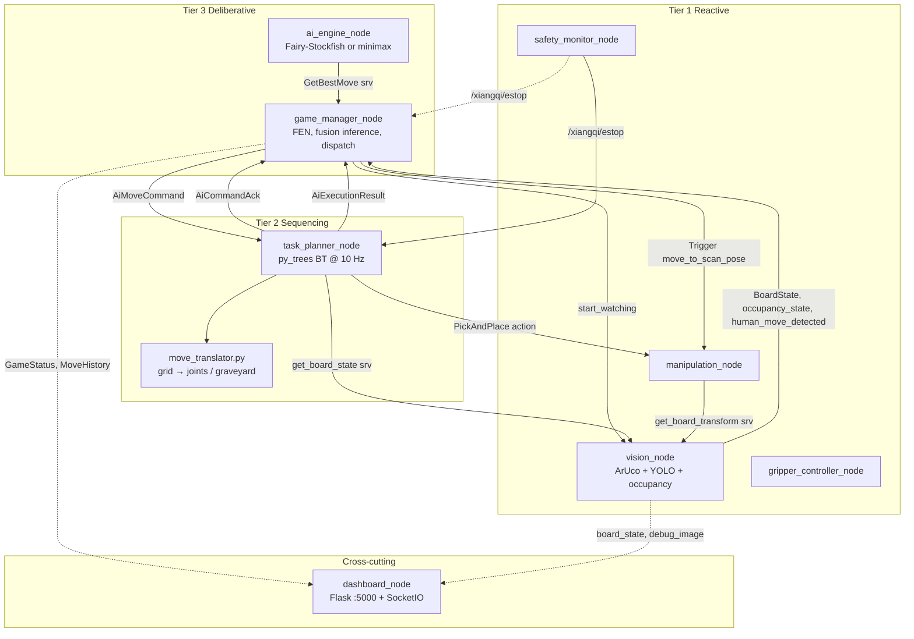
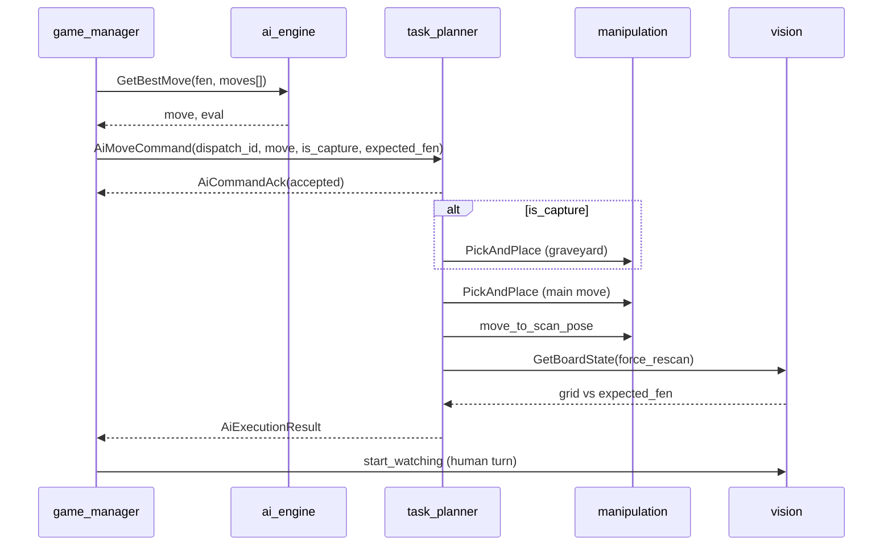
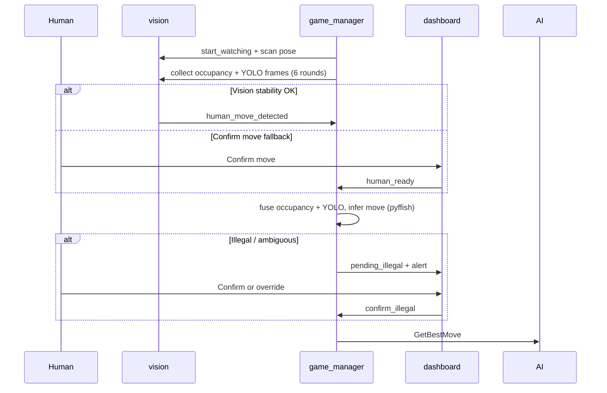

# Autonomous Xiangqi-Playing UR5e Cobot — Full System Plan

> **Runbook / setup:** [`README.md`](../../README.md). **Interface source of truth:** `workspace/src/xiangqi_msgs/` and §4 below. **Per-package detail:** `workspace/src/*/README.md`.

## 1. Lab Environment and Constraints

VXLab hardware ([`ur5evxlabdoc.md`](../../ur5evxlabdoc.md)):

| Device | Access |
|--------|--------|
| Dev box | `10.234.7.84`, Docker, ROS 2 Humble |
| UR5e | `10.234.6.49`, external control port `50002` |
| OnRobot RG2 (EyeBox) | `10.234.6.47`, Modbus TCP |
| Intel RealSense | USB3 on arm — board imaged from **scan pose** |

**Before** launching Xiangqi (inside UR5e_Env container):

```bash
arm_drivers          # UR5e + RG2 + camera
moveit_config_driver # MoveIt + /move_action + /par_moveit/waypoint_move
```

All project packages live under `~/workspace/src/`. Build with `build_workspace`. Connect-4 in `par_pkg` is a reference for pick-and-place patterns only.

**Docker:** extend [UR5e_Env](https://github.com/Kibibibit/UR5e_Env) with repo [`Dockerfile`](../../Dockerfile) → `ur5e_xiangqi:latest` (Fairy-Stockfish, ultralytics, pyffish, Flask, py_trees, ONNX).

---

## 2. Robot Software Architecture: Three-Tier Hierarchical

The assignment requires an explicit, justified Robot Software Architecture. A **Three-Tier Architecture** (Deliberative / Sequencing / Reactive) maps cleanly to this Xiangqi task.

**Implementation notes (vs early design sketches):**

- **`move_translator` is not a ROS node** — Python library (`xiangqi_manipulation/move_translator.py`) used by `task_planner_node` (BT `SetupMoveCoordinates`) and loaded from the same `board_calibration.yaml` as vision.
- **Human move detection and pyffish validation live in `game_manager_node`**, not in the behaviour tree. The BT runs **only after** an `AiMoveCommand` is published.
- **`manipulation_node` fetches board frame at startup** via `GetBoardTransform` from `vision_node` (ArUco-derived `board_to_base` + marker centres).
- **Hardware drivers are outside** `xiangqi_system.launch.py`.



**Justification (for report):** Deliberative layer holds authoritative game state and AI (no hard real-time constraints); Sequencing layer runs a behaviour tree for multi-step motion with capture and verification; Reactive layer performs perception and actuator commands. Superior to SPA (lacks explicit task structure) or pure Subsumption (cannot host chess-scale deliberation).

**Launched by `xiangqi_system.launch.py`:** `vision_node`, `manipulation_node`, `gripper_controller_node`, `safety_monitor_node`, `task_planner_node`, `ai_engine_node`, `game_manager_node`, `dashboard_node`.

---

## 3. ROS 2 Package Structure

```
workspace/src/
  xiangqi_bringup/         # Launch files, config YAML
  xiangqi_msgs/            # Custom messages, services, actions
  xiangqi_vision/          # vision_node, calibration_tool, YOLO + ArUco + occupancy
  xiangqi_ai/              # game_manager_node, ai_engine_node, minimax + FSF
  xiangqi_manipulation/    # manipulation_node, gripper, safety, move_translator
  xiangqi_planner/         # task_planner_node + py_trees behaviours
  xiangqi_dashboard/       # dashboard_node (Flask + SocketIO)
```

Runtime calibration (not in git): `/home/rosuser/workspace/config/board_calibration.yaml` after `calibration_tool`.

Lab YOLO weights: `workspace/models/xiangqi_kaggle_v4_best.onnx` (see [`workspace/models/README.md`](../../workspace/models/README.md)).

---

## 4. Custom interfaces (`xiangqi_msgs`)

Authoritative field definitions: `workspace/src/xiangqi_msgs/`.

### 4a. Messages

| Message | Purpose |
|---------|---------|
| `BoardState` | `int8[90]` grid (rank×9+file; ±1…±7 piece types), optional `fen`, mean YOLO confidence, `cell_confidence[90]` |
| `GameStatus` | FSM string + `pending_illegal_alert` when `status == pending_illegal`; `game_result` / `game_result_reason` |
| `MoveHistory` | Move log: UCI move, side, depth, cp, time, engine |
| `EngineInfo` | Live AI telemetry for dashboard |
| `PieceDetection` | Single detection record |
| `AiMoveCommand` | `dispatch_id`, `move`, `is_capture`, `expected_fen` |
| `AiCommandAck` | `dispatch_id`, `accepted`, `reason` |
| `AiExecutionResult` | `dispatch_id`, `status` (`ROBOT_MOVE_COMPLETE` \| `BOARD_VERIFY_FAILED` \| `AI_MOTION_FAILED`), `message` |

### 4b. Services

| Service | Server | Purpose |
|---------|--------|---------|
| `GetBoardState` | `vision_node` | Snapshot; `force_rescan` runs fresh pipeline |
| `GetBoardTransform` | `vision_node` | `board_to_base` 4×4 + `marker_centres_base` for manipulation |
| `GetBestMove` | `ai_engine_node` | FEN + depth/time + optional `moves[]` (repetition history) → move + stats |
| `SetEngine` | `ai_engine_node` | `fairystockfish` \| `minimax` + difficulty |
| `GripperControl` | `gripper_controller_node` | Width (mm), force (N) |

**Standard services:** `manipulation_node` exposes `std_srvs/Trigger` on `/xiangqi/move_to_scan_pose` and `/xiangqi/move_to_initial_pose`.

### 4c. Actions

| Action | Server | Purpose |
|--------|--------|---------|
| `PickAndPlace` | `manipulation_node` | **Primary motion** — pick/place poses, approach/transit heights |
| `ExecuteMove` | *(defined, unused in live BT)* | Higher-level move string; stack uses `PickAndPlace` + `AiMoveCommand` |

### 4d. Lab interfaces (external)

| Interface | Type | Name |
|-----------|------|------|
| Move group OMPL | action | `/move_action` |
| Cartesian waypoint | action | `/par_moveit/waypoint_move` |
| RG2 width | action | `/rg2/set_width` |
| UR safety | topic | `/ur_hardware_interface/safety_mode` |

---

## 4e. ROS 2 topic and service catalog

Topics under `/xiangqi/` unless noted.

| Topic | Type | Publisher | Main subscribers |
|-------|------|-----------|------------------|
| `board_state` | `BoardState` | `vision_node`, `game_manager` (sim) | `game_manager`, `dashboard` |
| `occupancy_state` | `BoardState` | `vision_node` | `game_manager`, `dashboard` |
| `human_move_detected` | `Bool` | `vision_node` | `game_manager` |
| `start_watching` | `Bool` | `game_manager` | `vision_node` |
| `human_ready` | `Empty` | `dashboard` | `vision_node`, `game_manager` |
| `confirm_illegal` | `String` | `dashboard` | `game_manager` |
| `game_status` | `GameStatus` | `game_manager` | `dashboard`, `task_planner` |
| `move_history` | `MoveHistory` | `game_manager` | `dashboard` |
| `engine_info` | `EngineInfo` | `ai_engine` | `dashboard` |
| `ai_move_command` | `AiMoveCommand` | `game_manager` | `task_planner` |
| `ai_command_ack` | `AiCommandAck` | `task_planner` | `game_manager` |
| `ai_execution_result` | `AiExecutionResult` | `task_planner` | `game_manager` |
| `illegal_move_alert` | `String` | `game_manager`, BT | `dashboard` |
| `estop` | `Bool` | `safety_monitor` | `game_manager`, `task_planner` |
| `emergency_stop` | `Bool` | `dashboard` | `safety_monitor` |
| `safety_status` | `String` | `safety_monitor` | `dashboard` |
| `gripper_active` | `Bool` | `gripper_controller` | `dashboard` |
| `debug_image` | `Image` | `vision_node` | debug / RViz |
| `new_game`, `stop_game`, `reset_game` | `Empty` | `dashboard` | `game_manager` |
| `game_mode` | `String` | `dashboard` | `ai_vs_ai` \| `ai_vs_human` |
| `ai_engines` | `String` | `dashboard` | JSON red/black engine |
| `human_color` | `String` | `dashboard` | `red` \| `black` |
| `simulate_human_move` | `String` | `dashboard` | sim clicks only |
| `resync_from_vision` | `Empty` | `dashboard` | Sync board from vision |

**Camera:** `vision_node` subscribes to `/camera/camera/color/image_raw` (param in `vision_config.yaml`; optional `camera_config.yaml`).

### End-to-end flow (robot move)



### End-to-end flow (human turn, hardware)



### `game_manager_node` FSM

| State | Meaning |
|-------|---------|
| `IDLE` | No active game |
| `WAITING_HUMAN` | Opponent turn; vision watching |
| `DETECTING_MOVE` | Multi-round rescan + infer human move |
| `COMPUTING_AI` | Async `GetBestMove` in flight |
| `EXECUTING_MOVE` | Waiting for matching `AiExecutionResult` |
| `PENDING_ILLEGAL` | Illegal move suspected; awaiting dashboard confirm/override |
| `GAME_OVER` | Terminal |

Published `GameStatus.status` strings align with these phases.

---

## 5. Vision Pipeline (`xiangqi_vision`)

### 5a. Board localization (every frame)

1. **ArUco** `DICT_4X4_50`, IDs **0–3** on sheet corners → homography → warp to **800×890** top-down image.
2. **`grid_spacing_mm`** in calibration must match real intersection spacing (lab: **61.25 mm**, 4×A3 mat).
3. Robot uses **9×10 grid index** (`rank * 9 + file`, rank 0 = Red), not SVG line parsing.

### 5b. Dual perception: YOLO + ResNet occupancy

| Layer | Model | Rate | Output |
|-------|-------|------|--------|
| **YOLO** | `xiangqi_kaggle_v4_best.onnx` (Ultralytics) | ~6 Hz (`poll_rate_hz`) | Piece type + colour per cell |
| **Occupancy** | ResNet-34 (`occupancy_real_board.pth`) | ~10 Hz (`cv_occ_rate_hz`) | Binary 0/1 per cell on `/xiangqi/occupancy_state` |

**Fusion (game_manager):** cell occupied if either sensor sees it; YOLO supplies type/colour where occupancy says occupied. Occupancy is more reliable for empty cells and AI-turn interference detection.

**Temporal stability (`vision_node`):**

| Mechanism | Parameter | Role |
|-----------|-----------|------|
| `GridStabilizer` | `grid_smooth_frames` | Per-cell hold until N agreeing YOLO frames |
| Type-change hold | `grid_type_change_frames` | Faster commit for piece-type flips |
| Occupancy stabilizer | (internal) | Same pattern on occupancy grid |
| `TurnDetector` | `stability_frames` | Human “move done” after stable grid |

Tune `confidence_threshold`, preprocess presets (`piece_preprocess_*`), and retrain when lighting is poor.

### 5c. Human move inference (original implementation — `game_manager_node`)

Not in vision: after stable board change, game manager:

1. Collects **6 occupancy frames** (`_HUMAN_SCAN_ROUNDS`) + **3 YOLO frames** (`_YOLO_SCAN_ROUNDS`).
2. Fuses occupancy delta with YOLO grid against authoritative FEN.
3. Validates via pyffish legal moves (`human_move_grid_tolerance: 12` in `game_config.yaml`).
4. On illegal/ambiguous → `PENDING_ILLEGAL` + dashboard confirm/override via `/xiangqi/confirm_illegal`.

Also detects interference during robot moves (occupancy watching on AI turn).

### 5d. Scan Board and prescan FEN

Dashboard **`POST /api/scan_board`**:

- 3-round majority-vote merge (`_SCAN_ROUNDS = 3`) via `GetBoardState(force_rescan)`.
- Stores result in `prescan_fen`; game manager uses it on **Start Game** instead of assuming standard start position.
- Requires idle/game_over state; moves arm to scan pose first (UI flow).

Startup scan in game manager: **7 frames** (`_STARTUP_SCAN_ROUNDS`) when no prescan available.

### 5e. `vision_node` interfaces

| Direction | Name | Type |
|-----------|------|------|
| Sub | `camera_topic` | `sensor_msgs/Image` |
| Sub | `/xiangqi/human_ready` | `std_msgs/Empty` |
| Sub | `/xiangqi/start_watching` | `std_msgs/Bool` |
| Pub | `/xiangqi/board_state` | `BoardState` |
| Pub | `/xiangqi/occupancy_state` | `BoardState` (binary grid) |
| Pub | `/xiangqi/human_move_detected` | `std_msgs/Bool` |
| Pub | `/xiangqi/debug_image` | `sensor_msgs/Image` |
| Srv | `get_board_state` | `GetBoardState` |
| Srv | `get_board_transform` | `GetBoardTransform` |

**Key params (`vision_config.yaml`):** `model_path`, `calibration_file`, `confidence_threshold`, `grid_smooth_frames`, `grid_type_change_frames`, `poll_rate_hz`, `cv_occ_*` (occupancy model path, ROI, threshold), `camera_config_file`.

**Auxiliary:** `calibration_tool`, `vision_preprocess_experiment`, `scripts/train_occupancy.py`, `tools/kaggle_train_real_board.py`.

---

## 6. Game Manager and AI (`xiangqi_ai`)

### Modes

| Mode | Hardware | Simulation |
|------|----------|------------|
| **AI vs Human** | Human moves pieces; robot plays other color | Human clicks board |
| **AI vs AI** | Robot plays both sides (full arm loop) | Instant FEN updates |

### Engines (same `GetBestMove` service)

| Engine | Implementation |
|--------|----------------|
| **Fairy-Stockfish** | UCI subprocess, `UCI_Variant xiangqi`, skill 1–20 |
| **Minimax** | Iterative deepening, alpha–beta, `evaluation.py`; legality via pyffish; **repetition-aware** via `prior_moves` in `GetBestMove` request |

**Config (`game_config.yaml`):** `ai_time_limit` (5 s hardware), `sim_ai_time_limit` (3 s), `trust_robot_move_after_verify_fail`, `minimax_nnue_display_eval` (shallow FSF eval for dashboard bar).

### Dispatch protocol

1. `GetBestMove` **without** applying AI move to FEN yet (passes move history for repetition).
2. Publish `AiMoveCommand` with monotonic `dispatch_id` and `expected_fen`.
3. Wait for `AiCommandAck` then `AiExecutionResult` with same `dispatch_id`.
4. On `ROBOT_MOVE_COMPLETE` → commit FEN. On failure / e-stop → discard pending move.

### Illegal move handling

`_flag_illegal_move()` → `PENDING_ILLEGAL` state → dashboard shows alert → operator confirms game over or overrides via `/api/confirm_illegal`. Covers human illegal moves, robot drop detection, and AI-turn interference.

---

## 7. Task Planner (`xiangqi_planner`)

Ticks at **10 Hz** when blackboard `ai_move` is set.

```
Root (Sequence)
  └── NotEstopped
        └── Selector MotionOrAbortReport
              ├── Sequence MoveSequence
              │     ├── SetupMoveCoordinates   (move_translator → poses)
              │     ├── CaptureOrSkip          (graveyard PickAndPlace if is_capture)
              │     ├── PickAIPiece            (main PickAndPlace)
              │     ├── GoToScanPose           (FailureIsSuccess)
              │     ├── VerifyBestEffort       (Retry VerifyBoardState ×5)
              │     └── FinalizeRobotMoveAfterVerify
              └── AiMotionFailureFinalizer     (AI_MOTION_FAILED)
```

Verify tolerance: `verify_grid_tolerance: 6` in `planner_config.yaml`.

---

## 8. Manipulation (`xiangqi_manipulation`)

### Motion stack (hardware)

Requires **`arm_drivers`** + **`moveit_config_driver`** first.

| Phase | Backend |
|-------|---------|
| Scan / homing | Joint `/move_action` from `scan_joint_positions` |
| Board cells (preferred) | **4-patch bilinear joint interpolation** from taught corners + midpoints |
| Fallback | OMPL `/move_action` + Cartesian `/par_moveit/waypoint_move` |
| Gripper | `/rg2/set_width` |
| Board frame | `GetBoardTransform` at startup (ArUco-derived Z and XY) |

**Action server:** `/xiangqi/pick_and_place`. **Triggers:** `/xiangqi/move_to_scan_pose`, `/xiangqi/move_to_initial_pose`.

Lab pieces ~20 mm diameter; grasp params in `manipulation_config.yaml` (`grasp_width: 18`, `grid_spacing_mm: 61.25`).

### `move_translator.py` (library)

UCI move → pick/place poses and joint targets from `board_calibration.yaml`. Graveyard joints per side for captures.

### Safety

`safety_monitor_node` ORs dashboard e-stop and UR protective stop → `/xiangqi/estop`.

Smoke test: `ros2 run xiangqi_manipulation test_moveit_move --move e5 e7`

---

## 9. Web Dashboard (`xiangqi_dashboard`)

- **URL:** `http://<host>:5000/`
- **Hardware:** Scan Board → Start Game → AI vs Human; Confirm move fallback; illegal-move confirm/override panel; e-stop.
- **Simulation:** board clicks; no arm drivers needed.
- **Stability:** grid hold in UI (N consecutive identical grids or high confidence).

Key APIs: `POST /api/scan_board`, `/api/new_game`, `/api/human_ready`, `/api/confirm_illegal`, `/api/set_engines`, `/api/move_to_scan_pose`.

---

## 10. Launch and Bringup (`xiangqi_bringup`)

### Prerequisites (not started by Xiangqi launch)

```bash
arm_drivers
moveit_config_driver
```

### Launches

| Launch | Purpose |
|--------|---------|
| `xiangqi_system.launch.py` | Full hardware stack |
| `xiangqi_sim.launch.py` | `simulation_mode:=true` |

**Config (`xiangqi_bringup/config/`):** `vision_config.yaml`, `game_config.yaml`, `manipulation_config.yaml`, `planner_config.yaml`, `robot_side.yaml`, `camera_config.yaml`; runtime `workspace/config/board_calibration.yaml`.

---

## 11. Physical Setup

- **Board mat:** 4×A3 assembly, ArUco at corners — [docs/board_printing_guide.md](../../docs/board_printing_guide.md); `grid_spacing_mm: 61.25`.
- **Pieces:** ~20 mm diameter lab set; RG2 side grasp.
- **Graveyard:** two off-board zones taught in calibration.
- **Camera:** RealSense at scan pose for full board view.
- **Reach:** UR5e base positioned so board + graveyards are within workspace.

---

## 12. Development Phases (completed)

| Phase | Deliverables | Status |
|-------|--------------|--------|
| 1 Infrastructure | Docker, 7 packages, xiangqi_msgs, three-tier skeleton | Done |
| 2 Vision | YOLO v4 ONNX, ArUco, occupancy net, calibration tool | Done |
| 3 AI | FSF + minimax, game manager FSM, move inference | Done |
| 4 Manipulation | PickAndPlace, joint teach-in, GetBoardTransform | Done |
| 5 Integration | Dashboard, BT, prescan, illegal-move flow, hardware games | Done |
| 6 Evaluation | Quantitative experiments for report | **Pending** |

---

## 13. Original Implementation Elements (rubric)

1. **Custom minimax engine** — alpha–beta, iterative deepening, hand-crafted eval, repetition history.
2. **Human move detection** — occupancy/YOLO fusion + pyffish validation; no off-the-shelf ROS package for Xiangqi.
3. **ResNet-34 occupancy layer** — fast binary occupancy fused with YOLO for robust move deltas.
4. **Board calibration pipeline** — ArUco homography + joint teach-in + `GetBoardTransform`.
5. **Behaviour tree** — capture, verify, scan pose, failure finalizers with `dispatch_id` protocol.
6. **Three-tier architecture** — explicit Deliberative / Sequencing / Reactive boundaries.

---

## 14. Extended UG Work (rubric 3.1 / 3.2)

- ROS 2 infrastructure: Docker extension, custom msgs, launch system, lab sync tools (`tools/lab_sync_rebuild.py`, `lab_export_yolo_onnx.sh`).
- Robot software architecture: three-tier design enforced via BT sequencing and topic contracts.
- Multiple algorithms: minimax vs Fairy-Stockfish (comparative analysis for report).

---

## 15. PG Experimental Design (rubric 3.3) — pending

| Experiment | Metric |
|------------|--------|
| Detection accuracy | Per-piece confusion matrix (YOLO + occupancy), N board configs |
| Move inference reliability | Correct human-move rate, false positives, illegal-move rate |
| Manipulation success | Grasp success, placement XY error (mm) |
| End-to-end games | Move cycle time, interventions, game completion rate |

---

## 16. Key Dependencies

- `pyffish`, Fairy-Stockfish, `ultralytics` (+ ONNX), OpenCV ArUco, `py_trees` / `py_trees_ros`, Flask + SocketIO, PyTorch (occupancy), MoveIt2 / UR drivers / RealSense (lab Docker).

---

## 17. Implementation Status and Known Gaps (June 2026)

| Area | Status | Notes |
|------|--------|-------|
| ROS packages + launch | Done | 7 packages |
| Vision ArUco + YOLO v4 ONNX | Done; fragile in bad light | Tune `grid_smooth_frames`, preprocess, retrain |
| ResNet occupancy + fusion | Done | `/xiangqi/occupancy_state`; improves empty-cell reliability |
| Human move inference | Done | Multi-round scan; Confirm move still reliable fallback |
| Illegal move confirmation | Done | `PENDING_ILLEGAL` + dashboard UI |
| Scan Board / prescan FEN | Done | 3-round majority vote before game start |
| AI FSF + minimax + repetition | Done | Move history in `GetBestMove` |
| BT + PickAndPlace + graveyard | Done | `dispatch_id` protocol |
| Dashboard | Done | Grid hold, Scan Board, illegal toasts |
| End-to-end hardware games | **Works** | Occasional verify fail / XY placement offset |
| Evaluation experiments | **Pending** | §15 templates |
| Vision jitter / placement tuning | **Open** | Lighting, calibration teach-in, YOLO retrain |
| `ExecuteMove.action` | Defined only | Live stack uses `PickAndPlace` |
| MCTS / third algorithm | Not started | Optional extension |
| Hand-in-frame detection | Not started | Optional |

**Report one-liner:** Three-tier stack is complete and plays full hardware games; remaining work is **quantitative evaluation** and **perception/placement tuning** (YOLO jitter, small XY offsets). **Confirm move** and **Scan Board** are dependable operator interfaces when vision is noisy.

---

## 18. Risk Mitigation

| Risk | Mitigation |
|------|------------|
| Gripper slips | Tune `grasp_width` / `grasp_force`; cylindrical piece sides |
| Camera / ArUco drift | Re-calibrate per session; Scan Board before each game |
| YOLO grid jitter | `grid_smooth_frames`, occupancy fusion, preprocess presets, v4 retrain |
| Placement XY offset | Re-teach corner/midpoint joints; verify `grid_spacing_mm` |
| MoveIt timeout | `allowed_planning_time`, retries; joint interpolation preferred |
| FSF subprocess hang | UCI timeouts; e-stop cancels in-flight `GetBestMove` |
| UR connection drops | Restart `arm_drivers`; dashboard e-stop before recovery |

---

## 19. Key Source Files

| File | Role |
|------|------|
| `xiangqi_bringup/config/*.yaml` | Runtime parameters |
| `xiangqi_vision/vision_node.py` | YOLO + occupancy loops, stabilizers, services |
| `xiangqi_vision/cell_occupancy_net.py` | ResNet-34 occupancy |
| `xiangqi_vision/piece_detector.py` | YOLO class map |
| `xiangqi_ai/game_manager_node.py` | Game FSM, fusion inference, illegal moves |
| `xiangqi_ai/minimax_engine.py` | Custom search |
| `xiangqi_planner/task_planner_node.py` | Behaviour tree |
| `xiangqi_manipulation/manipulation_node.py` | Pick-and-place, GetBoardTransform client |
| `xiangqi_manipulation/move_translator.py` | Grid → joints/poses |
| `xiangqi_dashboard/dashboard_node.py` | Scan Board API, prescan_fen, ROS bridge |
