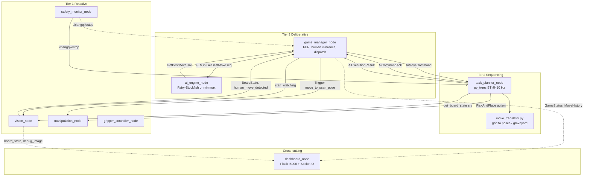
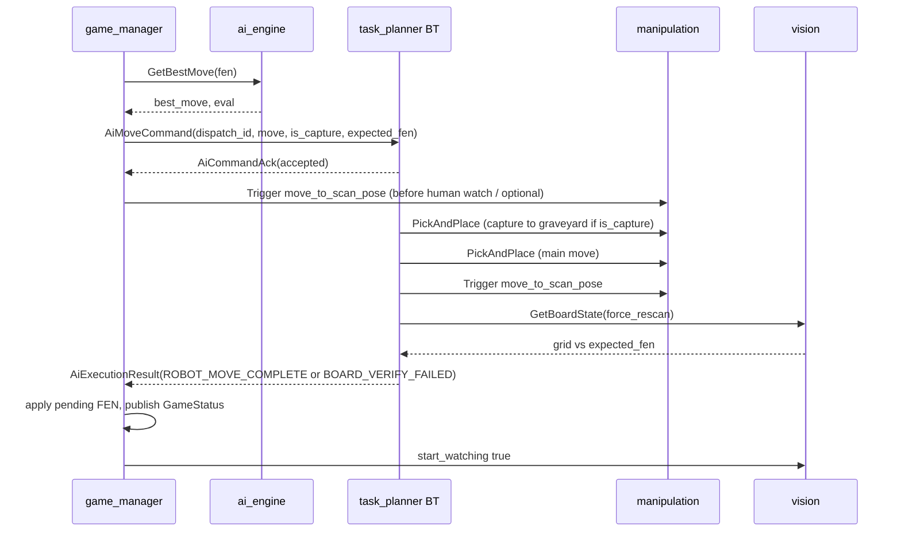
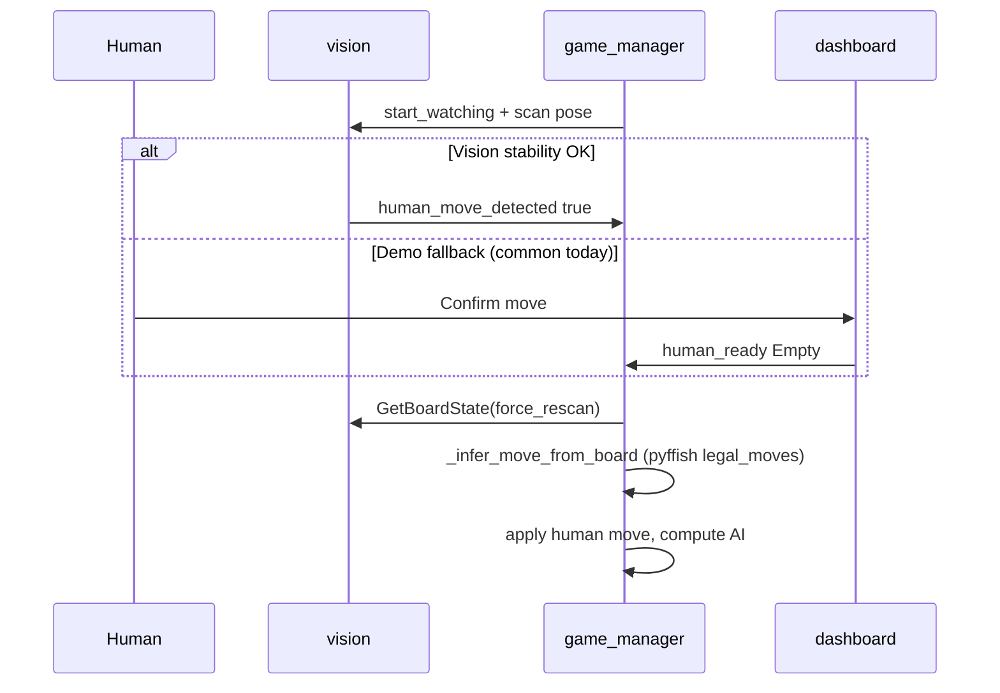

# Autonomous Xiangqi-Playing UR5e Cobot -- Full System Plan

> **Runbook / setup:** see repository [`README.md`](../../README.md). **Interface source of truth:** `workspace/src/xiangqi_msgs/` and §4e below.

## 1. Lab Environment and Constraints

The VXLab provides the following hardware, per [ur5evxlabdoc.md](ur5evxlabdoc.md):

- **Dev box** (Ubuntu, IP 10.234.7.84) running Docker with ROS 2 Humble
- **UR5e arm** via controller (IP 10.234.6.49, port 50002) with teach pendant for External Control
- **OnRobot RG2 two-finger gripper** via EyeBox (IP 10.234.6.47, Modbus TCP) — `onrobot_rg2_driver` in UR5e_Env
- **RGB camera** (Intel RealSense) connected via USB3 to the dev box
- **Existing Docker environment** from `Kibibibit/UR5e_Env` with aliases: `arm_drivers`, `moveit_config_driver`, `find_object_2d`, `realsense_driver`

All code lives inside the Docker container at `~/workspace/src/`. Build with `build_workspace`. The existing Connect-4 project in `par_pkg` serves as a reference for the pick-and-place pipeline.

---

## 2. Robot Software Architecture: Three-Tier Hierarchical

The assignment requires an explicit, justified Robot Software Architecture. A **Three-Tier Architecture** (Deliberative / Sequencing / Reactive) maps cleanly to this Xiangqi task.

**Important implementation notes (vs early design sketches):**

- **`move_translator` is not a ROS node** — it is a Python library (`xiangqi_manipulation/move_translator.py`) used by `task_planner_node` (BT `SetupMoveCoordinates`) and loaded from the same `board_calibration.yaml` as vision.
- **Human move detection and pyffish validation live in `game_manager_node`**, not in the behaviour tree. The BT runs **only after** an `AiMoveCommand` is published (robot move execution + verify).
- **Hardware drivers are outside this launch file** — start VXLab `arm_drivers` and `moveit_config_driver` before `xiangqi_system.launch.py`.



**Justification (for report):** The three-tier architecture separates concerns cleanly: the Deliberative layer holds authoritative game state and AI (no hard real-time constraints), the Sequencing layer runs a behaviour tree for multi-step motion with capture and verification, and the Reactive layer performs perception and actuator commands. This is superior to SPA (which lacks explicit task structure) or pure Subsumption (which cannot host chess-scale deliberation).

**Launched by `xiangqi_system.launch.py`:** `vision_node`, `manipulation_node`, `gripper_controller_node`, `safety_monitor_node`, `task_planner_node`, `ai_engine_node`, `game_manager_node`, `dashboard_node`.

---

## 3. ROS 2 Package Structure

All packages go under `~/workspace/src/` inside the Docker container.

```
workspace/src/
  xiangqi_bringup/         # Launch files, config YAML (vision, game, manipulation, planner)
  xiangqi_msgs/            # Custom messages, services, actions (see §4)
  xiangqi_vision/          # vision_node, calibration_tool, YOLO + ArUco pipeline
  xiangqi_ai/              # game_manager_node, ai_engine_node, minimax + FSF wrapper
  xiangqi_manipulation/    # manipulation_node, gripper_controller_node, safety_monitor_node, move_translator
  xiangqi_planner/         # task_planner_node + py_trees behaviours
  xiangqi_dashboard/       # dashboard_node (Flask + SocketIO bridge)
```

Runtime calibration output (not in git): `workspace/config/board_calibration.yaml` after `calibration_tool`.

---

## 4. Custom interfaces (`xiangqi_msgs`)

Authoritative field definitions are in `workspace/src/xiangqi_msgs/`. Summary:

### 4a. Messages

| Message | Purpose |
|---------|---------|
| `BoardState` | `int8[90]` grid (rank×9+file; ±1…±7 piece types), optional `fen`, `last_move`, `is_red_turn`, mean YOLO confidence |
| `GameStatus` | FSM string (`idle`, `waiting_human`, `detecting_move`, `computing_ai`, `executing_move`, `game_over`), `current_fen`, `engine_type`, `game_result` / `game_result_reason` |
| `MoveHistory` | One log line: UCI-style move, side, engine metadata (depth, cp, time) |
| `EngineInfo` | Live AI telemetry for dashboard (engine name, depth, eval, ponder) |
| `PieceDetection` | Single detection record (optional per-piece telemetry) |
| `AiMoveCommand` | **`dispatch_id`**, **`move`**, **`is_capture`**, **`expected_fen`** — atomic robot dispatch from game manager to planner |
| `AiCommandAck` | Planner ACK/NACK: **`dispatch_id`**, **`accepted`**, **`reason`** |
| `AiExecutionResult` | Planner result: **`dispatch_id`**, **`status`** (`ROBOT_MOVE_COMPLETE` \| `BOARD_VERIFY_FAILED` \| `AI_MOTION_FAILED`), **`message`** |

### 4b. Services

| Service | Server node | Purpose |
|---------|-------------|---------|
| `GetBoardState` | `vision_node` (`get_board_state`) | On-demand snapshot; `force_rescan` bypasses cache |
| `GetBestMove` | `ai_engine_node` (`get_best_move`) | FEN + depth/time + optional `engine_type` → UCI move + search stats |
| `SetEngine` | `ai_engine_node` (`set_engine`) | Runtime switch `fairystockfish` \| `minimax` + difficulty |
| `GripperControl` | `gripper_controller_node` (`/xiangqi/gripper_control`) | Target width/force (mm, N) → RG2 via lab driver |

**Standard services (not in `xiangqi_msgs`):**

| Service | Server | Purpose |
|---------|--------|---------|
| `std_srvs/Trigger` | `manipulation_node` | `/xiangqi/move_to_scan_pose`, `/xiangqi/move_to_initial_pose` |

### 4c. Actions

| Action | Server | Purpose |
|--------|--------|---------|
| `xiangqi_msgs/PickAndPlace` | `manipulation_node` (`/xiangqi/pick_and_place`) | **Primary motion primitive** — pick/place poses in `base_link`, approach/transit heights; feedback `phase` string |
| `xiangqi_msgs/ExecuteMove` | *(defined, not used in live BT)* | Higher-level move string; stack uses `PickAndPlace` + `AiMoveCommand` instead |

### 4d. Lab / UR5e_Env interfaces (external to `xiangqi_msgs`)

Used by `manipulation_node` on hardware (from `par_interfaces` / `onrobot_rg2_msgs`):

| Interface | Type | Name | Role |
|-----------|------|------|------|
| Move group OMPL | action | `/move_action` (param `move_group_action`) | Joint-space transit / homing |
| Cartesian waypoint | action | `/par_moveit/waypoint_move` | Vertical descend/lift over pieces |
| RG2 width | action | `/rg2/set_width` | Grasp / release (also called inside `manipulation_node`; `gripper_controller_node` exposes `GripperControl` for other callers) |
| UR safety | topic | `/ur_hardware_interface/safety_mode` | Protective stop input to `safety_monitor_node` |

---

## 4e. ROS 2 topic and service catalog (as implemented)

Unless noted, topics are under the `/xiangqi/` namespace. Service names without a leading `/ are resolved on the node that advertises them (`vision_node`, `ai_engine_node`).

### Topics — publish / subscribe matrix

| Topic | Type | Publisher | Main subscribers |
|-------|------|-----------|------------------|
| `/xiangqi/board_state` | `BoardState` | `vision_node`, `game_manager_node` (logical/sim) | `game_manager_node`, `dashboard_node` |
| `/xiangqi/human_move_detected` | `Bool` | `vision_node` | `game_manager_node`, `task_planner_node` (blackboard hint) |
| `/xiangqi/start_watching` | `Bool` | `game_manager_node` | `vision_node` |
| `/xiangqi/human_ready` | `Empty` | `dashboard_node` | `vision_node`, `game_manager_node` |
| `/xiangqi/game_status` | `GameStatus` | `game_manager_node` | `dashboard_node`, `task_planner_node` |
| `/xiangqi/move_history` | `MoveHistory` | `game_manager_node` | `dashboard_node` |
| `/xiangqi/engine_info` | `EngineInfo` | `ai_engine_node` | `dashboard_node` |
| `/xiangqi/ai_move_command` | `AiMoveCommand` | `game_manager_node` | `task_planner_node` |
| `/xiangqi/ai_command_ack` | `AiCommandAck` | `task_planner_node` | `game_manager_node` |
| `/xiangqi/ai_execution_result` | `AiExecutionResult` | `task_planner_node` | `game_manager_node` |
| `/xiangqi/illegal_move_alert` | `String` | `game_manager_node`, BT behaviours | `dashboard_node` |
| `/xiangqi/estop` | `Bool` | `safety_monitor_node` | `game_manager_node`, `task_planner_node` |
| `/xiangqi/emergency_stop` | `Bool` | `dashboard_node` | `safety_monitor_node` |
| `/xiangqi/safety_status` | `String` | `safety_monitor_node` | `dashboard_node` |
| `/xiangqi/gripper_active` | `Bool` | `gripper_controller_node` | `dashboard_node` |
| `/xiangqi/debug_image` | `sensor_msgs/Image` | `vision_node` | RViz / debug |
| `/xiangqi/new_game` | `Empty` | `dashboard_node` | `game_manager_node` |
| `/xiangqi/stop_game` | `Empty` | `dashboard_node` | `game_manager_node` |
| `/xiangqi/reset_game` | `Empty` | `dashboard_node` | `game_manager_node` |
| `/xiangqi/game_mode` | `String` | `dashboard_node` | `game_manager_node` (`ai_vs_ai` \| `ai_vs_human`) |
| `/xiangqi/ai_engines` | `String` | `dashboard_node` | `game_manager_node` (JSON: red/black engine) |
| `/xiangqi/human_color` | `String` | `dashboard_node` | `game_manager_node` (`red` \| `black`) |
| `/xiangqi/simulate_human_move` | `String` | `dashboard_node` | `game_manager_node` (sim AI vs human clicks) |
| `/xiangqi/resync_from_vision` | `Empty` | `dashboard_node` | `game_manager_node` (Sync board) |

**Camera input (parameterised, default in `vision_config.yaml`):** subscribe `vision_node` → `/camera/camera/color/image_raw` (RealSense; lab topic name).

### Services and actions — by node

| Node | Provides | Calls |
|------|----------|-------|
| `vision_node` | `get_board_state` (`GetBoardState`) | — |
| `ai_engine_node` | `get_best_move`, `set_engine` | — |
| `game_manager_node` | — | `get_best_move`, `get_board_state`, `/xiangqi/move_to_scan_pose` |
| `task_planner_node` | — | `get_board_state`, `/xiangqi/move_to_scan_pose`, `/xiangqi/pick_and_place` (via BT) |
| `manipulation_node` | `/xiangqi/pick_and_place`, `/xiangqi/move_to_scan_pose`, `/xiangqi/move_to_initial_pose` | `/move_action`, `/par_moveit/waypoint_move`, `/rg2/set_width` |
| `gripper_controller_node` | `/xiangqi/gripper_control` | `/rg2/set_width` |
| `safety_monitor_node` | — | subscribes UR safety + `/xiangqi/emergency_stop` |
| `dashboard_node` | HTTP `:5000` + SocketIO | `set_engine` client; publishes control topics above |

### End-to-end message flow (one robot move)



### End-to-end flow (human turn, hardware)



### `game_manager_node` FSM (internal `GameState`)

| State | Meaning |
|-------|---------|
| `IDLE` | No active game |
| `WAITING_HUMAN` | Human / opponent turn; vision watching or awaiting Confirm |
| `DETECTING_MOVE` | Rescan + infer human move from grid |
| `COMPUTING_AI` | Async `GetBestMove` in flight |
| `EXECUTING_MOVE` | `AiMoveCommand` dispatched; waiting for `AiExecutionResult` matching `dispatch_id` |
| `GAME_OVER` | Terminal |

Published `GameStatus.status` strings align with these (see `GameStatus.msg`).

---

## 5. Vision Pipeline (`xiangqi_vision`)

### 5a. Board Detection and Calibration

1. **One-time calibration**: Place a known Xiangqi board under the camera. Detect the four outer corner intersections of the 9x10 grid using ArUco markers (printed in corners of the board mat) or manual corner selection.
2. Compute a **homography matrix** (OpenCV `findHomography`) to map pixel coordinates to a top-down normalized board frame.
3. Derive a **board-to-robot-base transform** by teaching 3-4 reference points (e.g., corner intersections) to the robot and recording their TCP positions. This gives a `board_frame -> base_link` affine transform stored in a YAML config file.

### 5b. Piece Detection -- YOLOv8n (pretrain + fine-tune)

Following the approach validated by the Star-Robot chinese-chess-robot paper (YOLOv7-tiny achieved 99.3% mAP@0.75 on 888 images across 3 board types), we use the newer YOLOv8n architecture:

- Start from an existing online/Roboflow Xiangqi dataset; merge with **~200 lab-captured images** (own pieces + mat), **~1200 images total** after labeling.
- Fine-tune **YOLOv8** on the combined dataset (weights such as `xiangqi_kaggle_v1_best.pt`, `v2`, or lab-deployed `v3` per `vision_config.yaml`).
- Map detected bounding-box centers through the homography to get grid coordinates (file, rank).
- Expected performance: 99%+ mAP@0.75 based on the Star-Robot baseline with a comparable approach.

### 5c. Move Detection (original implementation)

This is a key **original implementation** element:
- After the human makes a physical move, take a new image and compare `board_state_before` vs `board_state_after`.
- Identify which intersection lost a piece and which gained one. Detect captures (a position changes piece color).
- Validate the detected move against Xiangqi rules using `pyffish` legal move generation.
- Handle edge cases: piece knocked sideways, hand occlusion (wait and re-scan), illegal move (alert human).

### 5d. Turn Detection -- Vision-Based with Keyboard Fallback

The robot must know when the human has finished their move without requiring manual input (the assignment demands full autonomy).

**Primary: Vision-based stability detection**
1. After the robot finishes its move, the vision node enters "watching" mode.
2. Continuously capture frames at ~2-5 Hz and run piece detection.
3. Compare each detected board state against the known `board_state_before` (the state after the robot's last move).
4. When a change is detected (at least one piece position differs), start a **stability counter**.
5. If the same new board state persists for N consecutive frames (~2 seconds / 5-10 frames), confirm the move. This ensures the human's hand has left the board.
6. If the board keeps changing (hand still moving), reset the stability counter.
7. Once stable, pass the new board state to the Game Manager for move validation.

**Fallback: Dashboard Confirm move**
- Topic `/xiangqi/human_ready` (`std_msgs/Empty`) — published by the dashboard **Confirm move** button (and usable from CLI).
- `game_manager_node` also subscribes to `human_ready` and forces a fresh `GetBoardState` + pyffish move inference.
- In current lab testing, **Confirm move is the reliable path** when YOLO grids are unstable; auto stability detection remains implemented for future tuning.

**Hand presence detection (optional enhancement)**
- Before running the stability check, optionally detect whether a hand/arm is present in the frame using a simple skin-color HSV mask or a lightweight hand detector.
- Only begin move detection when no hand is detected in the board region.

### 5e. ROS Node: `vision_node`

| Direction | Name | Type |
|-----------|------|------|
| Sub | `camera_topic` (param, default `/camera/camera/color/image_raw`) | `sensor_msgs/Image` |
| Sub | `/xiangqi/human_ready` | `std_msgs/Empty` |
| Sub | `/xiangqi/start_watching` | `std_msgs/Bool` |
| Pub | `/xiangqi/board_state` | `xiangqi_msgs/BoardState` |
| Pub | `/xiangqi/human_move_detected` | `std_msgs/Bool` |
| Pub | `/xiangqi/debug_image` | `sensor_msgs/Image` |
| Srv | `get_board_state` | `xiangqi_msgs/GetBoardState` |

**Parameters (see `vision_config.yaml`):** `model_path`, `calibration_file`, `confidence_threshold`, `stability_frames` (default 5), `poll_rate_hz` (default 4.0), optional piece preprocess preset.

**Auxiliary:** `calibration_tool` (CLI teach-in → `board_calibration.yaml`); optional `vision_preprocess_experiment` node for tuning lighting.

---

## 6. Web Dashboard (`xiangqi_dashboard`)

A Flask-based web dashboard running on the dev box, accessible from any browser (including a tablet next to the board for the demo).

### 6a. Features (implemented)

- **Live board** (HTML canvas): sim uses logical FEN; hardware uses vision grid with **glitch hold filter** before display updates.
- **Modes:** AI vs AI, AI vs Human; per-side engine (`fairystockfish` \| `minimax`); human color Red/Black; Stockfish difficulty slider.
- **Move history**, **engine eval bar** (`EngineInfo`), **phase chip**, game result banner.
- **Hardware:** Confirm move, Sync board (`/xiangqi/resync_from_vision`), physical-play banner; sim-only board clicks + `/api/legal_moves` highlights.
- **E-stop** → `/xiangqi/emergency_stop`; illegal/error toasts via `/xiangqi/illegal_move_alert`.

### 6b. Architecture

- `dashboard_node` bridges ROS ↔ Flask (`flask-socketio` on **port 5000**).
- **HTTP API examples:** `POST /api/human_ready`, `/api/sync_board`, `/api/set_engines`, `/api/legal_moves` (sim AI vs human only), `/api/simulate_move` (sim only).
- Publishes game control topics listed in §4e; subscribes `board_state`, `game_status`, `move_history`, `engine_info`, alerts.

### 6c. Value for demo and report

- During the live demo, the dashboard provides a clear visual narrative of what the system is doing at each step.
- Screenshots of the dashboard make excellent figures for the report (board state, AI evaluation, move history).
- The debug overlay is invaluable during development for tuning detection thresholds.

---

## 7. AI Engine (`xiangqi_ai`) -- Two Implementations (UG second algorithm)

The "multiple algorithm" UG requirement is fulfilled here: a custom-built minimax engine vs. the professional-grade Fairy-Stockfish, both exposed through the same `GetBestMove.srv` interface. This allows a direct, meaningful comparison in the report.

### 7a. Fairy-Stockfish Integration (primary, production engine)

- Download and compile Fairy-Stockfish binary inside the Docker image (add to Dockerfile).
- Wrap the engine in a Python ROS 2 node that communicates via subprocess using **UCI protocol**:

```python
# Pseudocode for engine wrapper
engine = subprocess.Popen(["fairy-stockfish"], stdin=PIPE, stdout=PIPE)
engine.stdin.write("uci\n")
engine.stdin.write("setoption name UCI_Variant value xiangqi\n")
engine.stdin.write("isready\n")
# ... wait for "readyok"
engine.stdin.write(f"position fen {fen}\n")
engine.stdin.write(f"go depth {depth}\n")
# ... parse "bestmove XXXX" from stdout
```

- **NNUE:** Fairy-Stockfish is NNUE-capable; set `XIANGQI_NNUE_PATH` to a `.nnue` file to load `EvalFile` (optional bake-in in `Dockerfile` is commented out). Dashboard minimax eval can use a **shallow FSF search** for display cp (`minimax_nnue_display_eval` in `game_config.yaml`) — not full MCTS.
- Expose as ROS service: `get_best_move` (`GetBestMove.srv`); runtime switch via `set_engine` (`SetEngine.srv`).

### 7b. Custom Minimax Engine (second algorithm, original implementation)

A from-scratch Xiangqi AI engine demonstrating core game-tree search:

- **Minimax with alpha-beta pruning**: Standard adversarial search with alpha-beta cutoffs to reduce the search space exponentially.
- **Iterative deepening**: Search depth 1, 2, 3, ... up to a time limit, returning the best move found so far. This gives anytime behavior and natural time management.
- **Move ordering**: Search captures and checks first to improve alpha-beta pruning efficiency.
- **Evaluation function** (the core original work):
  - **Material score**: Weighted piece values (General=10000, Chariot=900, Horse=400, Cannon=450, Advisor=200, Elephant=200, Soldier=100, with positional bonuses after crossing the river).
  - **Positional tables**: 9x10 piece-square tables giving bonuses/penalties for each piece type at each board position (e.g., Cannons are stronger in the center, Chariots on open files).
  - **King safety**: Penalty for exposed General, bonus for Advisors/Elephants near the palace.
  - **Mobility**: Bonus for number of legal moves available.
- **Legal move generation**: Use `pyffish` for correct move generation (avoids reimplementing complex Xiangqi rules like flying general, river crossing, palace confinement).
- Exposed through the same `GetBestMove.srv` interface, swappable via a ROS parameter `engine_type: "fairystockfish" | "minimax"`.

### 7c. Comparative Analysis (for report)

This comparison yields rich experimental data:
- **Move quality**: Play the two engines against each other over N games; measure win/loss/draw ratio.
- **Search depth vs. time**: At fixed time limits (1s, 3s, 5s), compare depth reached and evaluation confidence.
- **Move agreement**: Given the same position, how often do both engines choose the same move? Measures how close the custom engine gets to professional-grade play.
- **Positional understanding**: Present specific board positions where the custom engine fails (e.g., complex sacrifices, long-term positional play) to discuss fundamental limitations of static evaluation vs. NNUE.

### 7d. Game Manager Node (`game_manager_node`)

Central orchestrator in the Deliberative layer (see §4e for full I/O):

- Authoritative **FEN** + move history; **pyffish** for legality, game-over, human move inference (`_infer_move_from_board`).
- **Does not** send motion goals directly — publishes **`AiMoveCommand`** and waits for **`AiExecutionResult`** with matching **`dispatch_id`**.
- Hardware new game: startup **`GetBoardState`** scan (repair incomplete FEN rather than always `STARTING_FEN`).
- Parameters: `engine_type`, `self_play`, `simulation_mode`, `human_move_grid_tolerance`, `trust_robot_move_after_verify_fail`, per-side engines from dashboard.

---

## 8. Task Planner (`xiangqi_planner`) — Behaviour Tree

Uses **`py_trees`** (not a separate `py_trees_ros` action module in all behaviours). The tree **ticks at 10 Hz** only when blackboard `ai_move` is set (after `AiMoveCommand` ACK).

### 8a. Behaviour tree structure (as implemented)

```
Root (Sequence)
  └── NotEstopped (Inverter of IsEstopActive)
        └── Selector MotionOrAbortReport
              ├── Sequence MoveSequence (memory)
              │     ├── SetupMoveCoordinates  (move_translator → blackboard poses)
              │     ├── CaptureOrSkip (Selector)
              │     │     ├── NotACapture → skip
              │     │     └── CaptureSequence → PlaceInGraveyard (PickAndPlace)
              │     ├── ExecuteMove → PickAIPiece (PickAndPlace)
              │     ├── ScanPoseBestEffort → GoToScanPose (Trigger srv, FailureIsSuccess)
              │     ├── VerifyBestEffort → Retry(VerifyBoardState ×5, FailureIsSuccess)
              │     └── FinalizeRobotMoveAfterVerify → AiExecutionResult
              └── AiMotionFailureFinalizer → AiExecutionResult AI_MOTION_FAILED
```

**Not in the BT:** human turn, AI search, FEN commits — all in `game_manager_node`.

### 8b. Why Behaviour Tree over a monolithic FSM

- Retry/fallback on verify and best-effort scan pose without blocking deliberative logic.
- Capture subtree isolated from main pick-place.
- Clear mapping to demo narrative (capture → move → scan → verify).

### 8c. Coordinate translation (`move_translator`)

- Library (not a node): UCI move string → `pick_pose` / `place_pose` in `base_link`.
- **Joint teach-in:** corner (+ optional E-file and rank midpoints) approach joints → bilinear / multi-patch interpolation; graveyard joint configs per side.
- Homography + `board_to_base_tf` from `calibration_tool` (ArUco).

---

## 9. Manipulation (`xiangqi_manipulation`)

### 9a. Motion stack (hardware)

Requires VXLab **`moveit_config_driver`** + **`arm_drivers`** running first.

| Phase | Backend |
|-------|---------|
| Homing / large transit | OMPL **`/move_action`** (joint targets from calibration) |
| Vertical pick/place | Cartesian **`/par_moveit/waypoint_move`** when available |
| Gripper | **`/rg2/set_width`** (`GripperSetWidth`) inside `manipulation_node` |

**Action server:** `/xiangqi/pick_and_place` (`xiangqi_msgs/PickAndPlace`) — 8-step sequence with feedback `phase` strings.

**Triggers:** `/xiangqi/move_to_scan_pose`, `/xiangqi/move_to_initial_pose` (`std_srvs/Trigger`).

### 9b. `gripper_controller_node`

- Service **`/xiangqi/gripper_control`** (`GripperControl`: width mm, force N).
- Publishes **`/xiangqi/gripper_active`** for dashboard.
- BT pick-place uses `manipulation_node`’s RG2 client directly; this node is an alternate/ thin API.

### 9c. `safety_monitor_node`

- Subscribes **`/xiangqi/emergency_stop`** (dashboard) and **`/ur_hardware_interface/safety_mode`**.
- Publishes **`/xiangqi/estop`** and **`/xiangqi/safety_status`** (latched OR of dashboard + UR stop).

---

## 10. Launch and Bringup (`xiangqi_bringup`)

### Prerequisites (VXLab — **not** started by Xiangqi launch)

```bash
arm_drivers              # UR5e + RG2 + RealSense
moveit_config_driver     # MoveIt / move_action + waypoint_move
```

### `xiangqi_system.launch.py` (starts Xiangqi stack only)

```
vision_node
manipulation_node
gripper_controller_node
safety_monitor_node
task_planner_node
ai_engine_node
game_manager_node
dashboard_node          # http://<host>:5000
```

**Sim:** `xiangqi_sim.launch.py` → `simulation_mode:=true`, optional `vision_config_sim.yaml`.

**Config** (`xiangqi_bringup/config/`): `vision_config.yaml`, `game_config.yaml`, `manipulation_config.yaml`, `planner_config.yaml`, `robot_side.yaml`; runtime **`workspace/config/board_calibration.yaml`**.

---

## 11. Physical Setup

- **Xiangqi board**: Print a custom board mat (A2 or A3 size) with four ArUco markers at the outer corners for automatic calibration. Design the board digitally (e.g., Inkscape/Illustrator) with precise grid spacing ~40-50mm per intersection, standard Xiangqi line markings (river, palace diagonals), and the ArUco markers embedded into the corner margins. Print on thick card stock or laminate for durability. This gives full control over grid dimensions and marker placement.
- **Pieces**: Standard round Xiangqi pieces (~30–40 mm diameter). Cylindrical sides are ideal for RG2 side grasps; flat tops help vision.
- **Graveyard zones**: Two designated areas on either side of the board for captured pieces (red graveyard, black graveyard).
- **Camera mount**: Camera mounted on or near the robot, positioned to give a top-down view of the entire board. The RealSense is already USB-connected to the dev box.
- **Robot base position**: UR5e must be positioned so the full board + graveyard zones are within the ~850mm reach radius.

---

## 12. Development Phases and Timeline

### Phase 1: Infrastructure (Week 1-2) -- UG focus
- Fork/extend the Docker environment from `Kibibibit/UR5e_Env`
- Create all ROS 2 packages with `xiangqi_msgs`
- Set up the three-tier architecture node skeleton
- Board calibration utility (teach board corners, compute transforms)

### Phase 2: Vision Pipeline (Week 2-4)
- Download existing Roboflow xiangqi dataset, capture ~50-100 lab images, annotate and merge
- Fine-tune YOLOv8n model on combined dataset, integrate into `vision_node`
- Implement board state differencing for human move detection
- Implement vision-based turn detection (stability timeout + keyboard fallback)

### Phase 3: AI Engines (Week 2-4)
- Compile Fairy-Stockfish in Docker, build UCI subprocess wrapper as ROS service
- Implement Game Manager with pyffish for state/validation
- Build custom minimax + alpha-beta engine with evaluation function
- Test both engines with known positions, verify correct move generation
- Run engine-vs-engine matches for comparative data

### Phase 4: Manipulation (Week 3-5)
- Calibrate board-to-robot coordinate system
- Implement MoveIt2 pick-and-place action client
- Implement gripper control node
- Test individual pick-and-place on single pieces
- Tune approach/grasp/transit heights and speeds

### Phase 5: Dashboard and Integration (Week 5-6)
- Build Flask web dashboard with live board, move history, AI analysis, system status
- Connect all nodes via the Task Planner Behavior Tree
- Full game loop testing with dashboard monitoring
- Handle edge cases (captures, illegal moves, occlusion) via BT fallback subtrees
- Performance tuning (cycle time per move, detection accuracy)

### Phase 6: Evaluation and Report (Week 6-7) -- PG focus
- Measure and report: piece detection accuracy, move detection accuracy, pick-place success rate, average move cycle time
- Design experiments: vary lighting, piece styles, AI difficulty
- Write report following the required structure

---

## 13. Key "Original Implementation" Elements (for rubric)

These are not off-the-shelf and demonstrate original work:

1. **Custom Xiangqi minimax engine** -- from-scratch implementation of minimax + alpha-beta pruning with a hand-crafted evaluation function (material, positional tables, king safety, mobility). This is the most substantial original algorithm work.
2. **Human move detection via board-state differencing** -- comparing successive vision snapshots and validating against legal moves using pyffish. No existing ROS package does this for Xiangqi.
3. **Board calibration pipeline** -- ArUco-based homography + robot teach-point registration to bridge pixel space to robot workspace.
4. **Task Planner Behavior Tree** -- orchestrating the full game loop with capture handling, verification fallbacks, and retry/error recovery using `py_trees_ros`.
5. **Three-tier architecture enforcement** -- the deliberate separation into Deliberative/Sequencing/Reactive with explicit ROS 2 interfaces.

---

## 14. Extended UG Work (for rubric section 3.1 / 3.2)

- **ROS 2 Infrastructure**: Docker environment extension, custom message types, launch system, parameter management
- **Robot Software Architecture**: Three-tier design with explicit interface boundaries, enforced via Behavior Tree sequencing layer
- **Multiple Algorithm Implementations**: Custom minimax+alpha-beta Xiangqi engine vs. Fairy-Stockfish (comparative analysis: move quality, search depth, time, win rate)

---

## 15. PG Experimental Design (for rubric section 3.3)

- **Experiment 1 -- Detection accuracy**: Run N=100 board configurations, measure per-piece detection accuracy (confusion matrix across 14 piece classes).
- **Experiment 2 -- Move detection reliability**: Execute M=50 human moves, measure correct detection rate, false positive rate.
- **Experiment 3 -- Manipulation success rate**: Execute K=50 pick-and-place operations, measure grasp success, placement accuracy (mm error from target).
- **Experiment 4 -- End-to-end game performance**: Play N=5 complete games, record move times, errors, human interventions needed.

---

## 16. Key Dependencies

- `pyffish` (pip) -- Xiangqi legal moves, FEN management
- Fairy-Stockfish binary -- compiled from source in Docker
- `ultralytics` (pip) -- YOLOv8 training and inference
- OpenCV (`cv2`) -- image processing, homography, ArUco detection
- `py_trees` + `py_trees_ros` (pip/apt) -- Behavior Tree framework for task planning
- `flask` + `flask-socketio` (pip) -- Web dashboard backend
- MoveIt2 -- already installed in lab Docker
- `ur_robot_driver` -- already in lab Docker
- `realsense2_camera` -- already in lab Docker

---

## 17. Implementation status and known gaps (May 2026)

| Area | Status | Notes |
|------|--------|-------|
| ROS packages + launch | Done | 7 packages; see §10 |
| Vision YOLO + ArUco | Done, **fragile on hardware** | Grid jitter drives FEN/human-inference failures; Confirm move reliable |
| Human move pyffish inference | Implemented | Depends on stable `BoardState` |
| AI FSF + minimax | Done | NNUE weights optional via env var |
| BT + PickAndPlace + graveyard | Done | `dispatch_id` protocol |
| Dashboard modes | Done | Sim legal-move UI; hardware Confirm/Sync |
| MCTS / third algorithm | **Not started** | Planned extension |
| Hand-in-frame detection | **Not started** | Optional in §5d |
| Full hardware integration test | **Pending** (todo) | End-to-end logged games |
| Evaluation experiments | **Pending** (todo) | §15 templates |
| `ExecuteMove.action` | Defined only | Live stack uses `PickAndPlace` |

**Report one-liner:** Deliberative + sequencing + reactive stack is complete; lab autonomy is limited by **perception stability** and **grasp calibration**, with **Confirm move** as the dependable human-turn interface until vision is tuned.

---

## 18. Risk Mitigation

- **Gripper slips**: Tune `grasp_width` / `grasp_force` in `manipulation_config.yaml`; ensure smooth cylindrical sides; test with actual pieces early.
- **Camera calibration drift**: Re-calibrate at start of each session; ArUco markers are fast to detect.
- **Vision false grids**: Increase `stability_frames`, lab YOLO retrain, preprocess presets; use Sync board after slips.
- **MoveIt / OMPL timeout**: `allowed_planning_time`, retries in `manipulation_config.yaml`; Cartesian for vertical segments.
- **Fairy-Stockfish subprocess hangs**: Timeouts on UCI; game manager cancels in-flight `GetBestMove` on e-stop.
- **UR connection drops**: Known lab issue; restart `arm_drivers`; dashboard e-stop before recovery.
