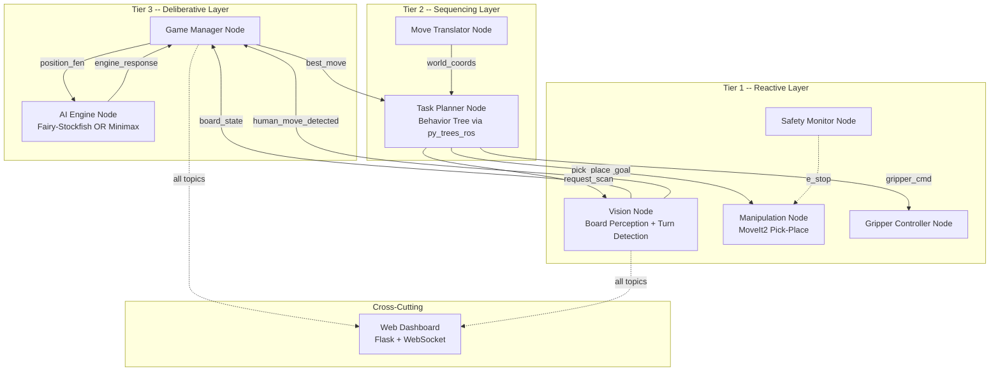

# Autonomous Xiangqi-Playing UR5e Cobot -- Full System Plan

## 1. Lab Environment and Constraints

The VXLab provides the following hardware, per [ur5evxlabdoc.md](ur5evxlabdoc.md):

- **Dev box** (Ubuntu, IP 10.234.7.84) running Docker with ROS 2 Humble
- **UR5e arm** via controller (IP 10.234.6.49, port 50002) with teach pendant for External Control
- **OnRobot RG2 two-finger gripper** via EyeBox (IP 10.234.6.47, Modbus TCP) — `onrobot_rg2_driver` in UR5e_Env
- **RGB camera** (Intel RealSense) connected via USB3 to the dev box
- **Existing Docker environment** from `Kibibibit/UR5e_Env` with aliases: `arm_drivers`, `moveit_config_driver`, `find_object_2d`, `realsense_driver`

All code lives inside the Docker container at `~/workspace/src/`. Build with `build_workspace`. The existing Connect-4 project in `par_pkg` serves as a reference for the pick-and-place pipeline.

---

## 2. Robot Software Architecture: Three-Tier Hierarchical

The assignment requires an explicit, justified Robot Software Architecture. A **Three-Tier Architecture** (Deliberative / Sequencing / Reactive) maps cleanly to this Xiangqi task:



**Justification (for report):** The three-tier architecture separates concerns cleanly: the Deliberative layer handles game intelligence (no real-time constraints), the Sequencing layer orchestrates multi-step pick-and-place sequences, and the Reactive layer provides fast sensor-motor loops. This is superior to SPA (which lacks planning) or pure Subsumption (which cannot handle the complex deliberation needed for chess AI).

---

## 3. ROS 2 Package Structure

All packages go under `~/workspace/src/` inside the Docker container.

```
workspace/src/
  xiangqi_bringup/         # Launch files, system-level config
  xiangqi_msgs/            # Custom message/service/action definitions
  xiangqi_vision/          # Board detection, piece recognition, board state, turn detection
  xiangqi_ai/              # Fairy-Stockfish wrapper, custom minimax engine, game logic
  xiangqi_manipulation/    # MoveIt2 pick-place, coord transforms, gripper
  xiangqi_planner/         # Task planner Behavior Tree, move sequencing
  xiangqi_dashboard/       # Flask web dashboard for monitoring, debugging, demo
```

---

## 4. Custom Messages and Services (`xiangqi_msgs`)

```
msg/
  BoardState.msg           # int8[90] grid, string fen, string last_move
  PieceDetection.msg       # string piece_type, float64 x, float64 y, float64 confidence
  GameStatus.msg           # string status (playing/red_wins/black_wins/draw), bool is_red_turn

srv/
  GetBoardState.srv        # {} -> BoardState
  GetBestMove.srv          # string fen, int32 depth -> string best_move, string ponder
  PickAndPlace.srv         # geometry_msgs/Pose pick, geometry_msgs/Pose place -> bool success
  GripperControl.srv       # bool activate -> bool success

action/
  ExecuteMove.action       # string move (e.g. "b0c2") -> bool success | string feedback
```

---

## 5. Vision Pipeline (`xiangqi_vision`)

### 5a. Board Detection and Calibration

1. **One-time calibration**: Place a known Xiangqi board under the camera. Detect the four outer corner intersections of the 9x10 grid using ArUco markers (printed in corners of the board mat) or manual corner selection.
2. Compute a **homography matrix** (OpenCV `findHomography`) to map pixel coordinates to a top-down normalized board frame.
3. Derive a **board-to-robot-base transform** by teaching 3-4 reference points (e.g., corner intersections) to the robot and recording their TCP positions. This gives a `board_frame -> base_link` affine transform stored in a YAML config file.

### 5b. Piece Detection -- YOLOv8n (pretrain + fine-tune)

Following the approach validated by the Star-Robot chinese-chess-robot paper (YOLOv7-tiny achieved 99.3% mAP@0.75 on 888 images across 3 board types), we use the newer YOLOv8n architecture:

- Start from an existing Roboflow Xiangqi dataset (200+ annotated images, 15 classes: 7 red pieces + 7 black pieces + empty intersection).
- Capture ~50-100 additional images from the lab RealSense camera with your actual pieces and custom-printed board mat under lab lighting conditions.
- Annotate the lab images (Roboflow web annotator) and merge with the existing dataset.
- Fine-tune YOLOv8n (nano) on the combined dataset. This adapts the model to your specific pieces, board, and lighting while leveraging the existing labeled data.
- Map detected bounding-box centers through the homography to get grid coordinates (file, rank).
- Expected performance: 99%+ mAP@0.75 based on the Star-Robot baseline with a comparable approach.

### 5c. Move Detection (original implementation)

This is a key **original implementation** element:
- After the human makes a physical move, take a new image and compare `board_state_before` vs `board_state_after`.
- Identify which intersection lost a piece and which gained one. Detect captures (a position changes piece color).
- Validate the detected move against Xiangqi rules using `pyffish` legal move generation.
- Handle edge cases: piece knocked sideways, hand occlusion (wait and re-scan), illegal move (alert human).

### 5d. Turn Detection -- Vision-Based with Keyboard Fallback

The robot must know when the human has finished their move without requiring manual input (the assignment demands full autonomy).

**Primary: Vision-based stability detection**
1. After the robot finishes its move, the vision node enters "watching" mode.
2. Continuously capture frames at ~2-5 Hz and run piece detection.
3. Compare each detected board state against the known `board_state_before` (the state after the robot's last move).
4. When a change is detected (at least one piece position differs), start a **stability counter**.
5. If the same new board state persists for N consecutive frames (~2 seconds / 5-10 frames), confirm the move. This ensures the human's hand has left the board.
6. If the board keeps changing (hand still moving), reset the stability counter.
7. Once stable, pass the new board state to the Game Manager for move validation.

**Fallback: Keyboard trigger**
- A ROS topic `/xiangqi/human_ready` (std_msgs/Empty) can be published via a simple keyboard node.
- If the vision stability detection gets stuck (e.g., lighting change causes false positives), the human can press a key to force a board scan.
- This is a safety net for the demo, not the primary mechanism.

**Hand presence detection (optional enhancement)**
- Before running the stability check, optionally detect whether a hand/arm is present in the frame using a simple skin-color HSV mask or a lightweight hand detector.
- Only begin move detection when no hand is detected in the board region.

### 5e. ROS Node: `vision_node`
- Subscribes to `/camera/color/image_raw` (RealSense RGB topic)
- Publishes `BoardState` on `/xiangqi/board_state`
- Publishes `Bool` on `/xiangqi/human_move_detected` (triggers when stable change found)
- Provides service `GetBoardState`
- Subscribes to `/xiangqi/human_ready` (keyboard fallback trigger)
- Parameters: `homography_matrix`, `model_path`, `confidence_threshold`, `board_to_base_tf`, `stability_frames: 8`, `poll_rate_hz: 3.0`

---

## 6. Web Dashboard (`xiangqi_dashboard`)

A Flask-based web dashboard running on the dev box, accessible from any browser (including a tablet next to the board for the demo).

### 6a. Features

- **Live board visualization**: Render the 9x10 Xiangqi grid with piece positions using SVG or HTML canvas. Updates in real-time via WebSocket as `BoardState` messages arrive.
- **Move history panel**: Scrollable list of all moves in algebraic notation (e.g., "R: h0-h4, B: b9-c7") with timestamps.
- **AI analysis panel**: Shows current engine evaluation (centipawn score), search depth, thinking time, and the selected engine type (Fairy-Stockfish vs. minimax).
- **System status panel**: Node health indicators (green/red), last detection confidence scores per piece, camera feed thumbnail, gripper state.
- **Game controls**: New game button, engine selector dropdown, difficulty slider, emergency stop button.
- **Debug mode**: Toggle to show raw detection overlay (bounding boxes on camera image), homography grid, and BT execution state.

### 6b. Architecture

- A ROS 2 node (`dashboard_node`) subscribes to key topics (`/xiangqi/board_state`, `/xiangqi/game_status`, `/xiangqi/move_history`) and bridges them to the Flask app via a shared state or `rclpy` spinning in a background thread.
- Flask serves static HTML/JS/CSS. WebSocket (via `flask-socketio`) pushes real-time updates to the browser.
- Runs on port 5000, accessible at `http://<dev_box_ip>:5000`.

### 6c. Value for demo and report

- During the live demo, the dashboard provides a clear visual narrative of what the system is doing at each step.
- Screenshots of the dashboard make excellent figures for the report (board state, AI evaluation, move history).
- The debug overlay is invaluable during development for tuning detection thresholds.

---

## 7. AI Engine (`xiangqi_ai`) -- Two Implementations (UG second algorithm)

The "multiple algorithm" UG requirement is fulfilled here: a custom-built minimax engine vs. the professional-grade Fairy-Stockfish, both exposed through the same `GetBestMove.srv` interface. This allows a direct, meaningful comparison in the report.

### 6a. Fairy-Stockfish Integration (primary, production engine)

- Download and compile Fairy-Stockfish binary inside the Docker image (add to Dockerfile).
- Wrap the engine in a Python ROS 2 node that communicates via subprocess using **UCI protocol**:

```python
# Pseudocode for engine wrapper
engine = subprocess.Popen(["fairy-stockfish"], stdin=PIPE, stdout=PIPE)
engine.stdin.write("uci\n")
engine.stdin.write("setoption name UCI_Variant value xiangqi\n")
engine.stdin.write("isready\n")
# ... wait for "readyok"
engine.stdin.write(f"position fen {fen}\n")
engine.stdin.write(f"go depth {depth}\n")
# ... parse "bestmove XXXX" from stdout
```

- Optionally download the Xiangqi NNUE weights for stronger play.
- Expose as ROS service: `GetBestMove.srv`

### 6b. Custom Minimax Engine (second algorithm, original implementation)

A from-scratch Xiangqi AI engine demonstrating core game-tree search:

- **Minimax with alpha-beta pruning**: Standard adversarial search with alpha-beta cutoffs to reduce the search space exponentially.
- **Iterative deepening**: Search depth 1, 2, 3, ... up to a time limit, returning the best move found so far. This gives anytime behavior and natural time management.
- **Move ordering**: Search captures and checks first to improve alpha-beta pruning efficiency.
- **Evaluation function** (the core original work):
  - **Material score**: Weighted piece values (General=10000, Chariot=900, Horse=400, Cannon=450, Advisor=200, Elephant=200, Soldier=100, with positional bonuses after crossing the river).
  - **Positional tables**: 9x10 piece-square tables giving bonuses/penalties for each piece type at each board position (e.g., Cannons are stronger in the center, Chariots on open files).
  - **King safety**: Penalty for exposed General, bonus for Advisors/Elephants near the palace.
  - **Mobility**: Bonus for number of legal moves available.
- **Legal move generation**: Use `pyffish` for correct move generation (avoids reimplementing complex Xiangqi rules like flying general, river crossing, palace confinement).
- Exposed through the same `GetBestMove.srv` interface, swappable via a ROS parameter `engine_type: "fairystockfish" | "minimax"`.

### 6c. Comparative Analysis (for report)

This comparison yields rich experimental data:
- **Move quality**: Play the two engines against each other over N games; measure win/loss/draw ratio.
- **Search depth vs. time**: At fixed time limits (1s, 3s, 5s), compare depth reached and evaluation confidence.
- **Move agreement**: Given the same position, how often do both engines choose the same move? Measures how close the custom engine gets to professional-grade play.
- **Positional understanding**: Present specific board positions where the custom engine fails (e.g., complex sacrifices, long-term positional play) to discuss fundamental limitations of static evaluation vs. NNUE.

### 6d. Game Manager Node (`game_manager_node`)

Central orchestrator in the Deliberative layer:
- Maintains authoritative game state as a FEN string.
- Uses `pyffish` library for legal move validation, game-over detection, FEN updates.
- State machine: `WAIT_HUMAN_MOVE -> DETECT_HUMAN_MOVE -> VALIDATE -> COMPUTE_AI_MOVE -> EXECUTE_AI_MOVE -> WAIT_HUMAN_MOVE`
- Publishes `GameStatus` on `/xiangqi/game_status`
- ROS parameter `engine_type` selects which AI engine to use

---

## 7. Task Planner (`xiangqi_planner`) -- Behavior Tree

Uses `py_trees` / `py_trees_ros` for modular, recoverable move execution.

### 7a. Behavior Tree Structure

```
Root (Sequence)
  ├── WaitForHumanMove (subscriber-based condition)
  ├── DetectHumanMove (service call to vision)
  ├── ValidateHumanMove (pyffish check via game_manager)
  │    └── Fallback: IllegalMoveAlert -> re-scan
  ├── ComputeAIMove (service call to AI engine)
  ├── ExecuteAIMove (Sequence)
  │    ├── Selector: IsCaptureMove?
  │    │    ├── Yes -> CaptureSubtree (Sequence)
  │    │    │    ├── PickCapturedPiece (from destination)
  │    │    │    └── PlaceInGraveyard
  │    │    └── No -> Skip
  │    ├── PickAIPiece (from source square)
  │    ├── PlaceAIPiece (at destination square)
  │    └── Fallback: VerifyBoardState
  │         ├── VisionScan matches expected -> Success
  │         └── Retry (re-scan up to 3x) -> AlertOperator
  └── UpdateGameState
```

Each leaf node (PickPiece, PlacePiece, etc.) is a `py_trees_ros` action client that calls into the manipulation layer. Fallback nodes handle retry logic naturally -- e.g., if a pick fails, the BT retries before escalating.

### 7b. Why Behavior Tree over FSM

- **Natural retry/fallback**: Fallback composites handle failure gracefully without spaghetti transitions.
- **Modular**: Each subtree (capture, simple move, verify) is reusable and independently testable.
- **Readable**: The tree structure maps directly to the task description, making it easy to explain in the report.
- **Extensible**: Adding new behaviors (e.g., "offer draw", "undo move") is just appending subtrees.

### 7b. Coordinate Translation (`move_translator`)

- Converts algebraic Xiangqi coordinates (file 0-8, rank 0-9) to world-frame (x, y, z) poses using the calibrated `board_to_base_tf`.
- Adds appropriate z-offsets for: approach height, grasp height, transit height.
- Publishes pick and place poses as `geometry_msgs/PoseStamped`.

---

## 8. Manipulation (`xiangqi_manipulation`)

### 8a. MoveIt2 Integration

- Use the existing `moveit_config_driver` from the lab Docker environment.
- Create a MoveIt2 action client node that accepts `PickAndPlace` goals.
- Motion sequence for each pick-and-place:
  1. Move to approach pose (above pick position, +Z offset ~80mm)
  2. Descend to grasp pose (piece surface height)
  3. Close RG2 to grasp piece
  4. Ascend to transit height
  5. Move to approach pose above place position
  6. Descend to place pose
  7. Open RG2 to release piece
  8. Ascend to safe transit height

### 8b. Gripper Control

The VXLab UR5e uses an OnRobot RG2 two-finger gripper via the EyeBox (IP 10.234.6.47). Based on the existing lab setup:
- Control via Modbus TCP (`onrobot_rg2_driver`: set width / force actions).
- ROS service wrapper: `GripperControl.srv` with `activate: bool`.
- Alternatively, if the EyeBox has a REST/TCP API, wrap that instead.

### 8c. Safety Monitor

- Monitor force/torque sensor on UR5e for unexpected contacts.
- Subscribe to UR robot state topics for protective stops.
- Enforce workspace boundaries (rectangular region around the board + graveyard).

---

## 9. Launch and Bringup (`xiangqi_bringup`)

### Main launch file `xiangqi_system.launch.py`:

```
arm_drivers                    # UR5e + gripper + camera (existing alias)
moveit_config_driver           # MoveIt2 (existing alias)
vision_node                    # xiangqi_vision (detection + turn monitoring)
game_manager_node              # xiangqi_ai
ai_engine_node                 # xiangqi_ai (Fairy-Stockfish or minimax, via param)
task_planner_node              # xiangqi_planner (Behavior Tree)
manipulation_node              # xiangqi_manipulation
gripper_controller_node        # xiangqi_manipulation
safety_monitor_node            # xiangqi_manipulation
dashboard_node                 # xiangqi_dashboard (Flask web UI on port 5000)
```

Config files in `config/`:
- `board_calibration.yaml` -- homography, board-to-base transform, grid dimensions
- `game_config.yaml` -- AI difficulty, engine type, time limits, graveyard coordinates
- `manipulation_config.yaml` -- z-offsets, speed scaling, waypoint heights
- `vision_config.yaml` -- stability frames, poll rate, confidence threshold, model path

---

## 10. Physical Setup

- **Xiangqi board**: Print a custom board mat (A2 or A3 size) with four ArUco markers at the outer corners for automatic calibration. Design the board digitally (e.g., Inkscape/Illustrator) with precise grid spacing ~40-50mm per intersection, standard Xiangqi line markings (river, palace diagonals), and the ArUco markers embedded into the corner margins. Print on thick card stock or laminate for durability. This gives full control over grid dimensions and marker placement.
- **Pieces**: Standard round Xiangqi pieces (~30–40 mm diameter). Cylindrical sides are ideal for RG2 side grasps; flat tops help vision.
- **Graveyard zones**: Two designated areas on either side of the board for captured pieces (red graveyard, black graveyard).
- **Camera mount**: Camera mounted on or near the robot, positioned to give a top-down view of the entire board. The RealSense is already USB-connected to the dev box.
- **Robot base position**: UR5e must be positioned so the full board + graveyard zones are within the ~850mm reach radius.

---

## 11. Development Phases and Timeline

### Phase 1: Infrastructure (Week 1-2) -- UG focus
- Fork/extend the Docker environment from `Kibibibit/UR5e_Env`
- Create all ROS 2 packages with `xiangqi_msgs`
- Set up the three-tier architecture node skeleton
- Board calibration utility (teach board corners, compute transforms)

### Phase 2: Vision Pipeline (Week 2-4)
- Download existing Roboflow xiangqi dataset, capture ~50-100 lab images, annotate and merge
- Fine-tune YOLOv8n model on combined dataset, integrate into `vision_node`
- Implement board state differencing for human move detection
- Implement vision-based turn detection (stability timeout + keyboard fallback)

### Phase 3: AI Engines (Week 2-4)
- Compile Fairy-Stockfish in Docker, build UCI subprocess wrapper as ROS service
- Implement Game Manager with pyffish for state/validation
- Build custom minimax + alpha-beta engine with evaluation function
- Test both engines with known positions, verify correct move generation
- Run engine-vs-engine matches for comparative data

### Phase 4: Manipulation (Week 3-5)
- Calibrate board-to-robot coordinate system
- Implement MoveIt2 pick-and-place action client
- Implement gripper control node
- Test individual pick-and-place on single pieces
- Tune approach/grasp/transit heights and speeds

### Phase 5: Dashboard and Integration (Week 5-6)
- Build Flask web dashboard with live board, move history, AI analysis, system status
- Connect all nodes via the Task Planner Behavior Tree
- Full game loop testing with dashboard monitoring
- Handle edge cases (captures, illegal moves, occlusion) via BT fallback subtrees
- Performance tuning (cycle time per move, detection accuracy)

### Phase 6: Evaluation and Report (Week 6-7) -- PG focus
- Measure and report: piece detection accuracy, move detection accuracy, pick-place success rate, average move cycle time
- Design experiments: vary lighting, piece styles, AI difficulty
- Write report following the required structure

---

## 12. Key "Original Implementation" Elements (for rubric)

These are not off-the-shelf and demonstrate original work:

1. **Custom Xiangqi minimax engine** -- from-scratch implementation of minimax + alpha-beta pruning with a hand-crafted evaluation function (material, positional tables, king safety, mobility). This is the most substantial original algorithm work.
2. **Human move detection via board-state differencing** -- comparing successive vision snapshots and validating against legal moves using pyffish. No existing ROS package does this for Xiangqi.
3. **Board calibration pipeline** -- ArUco-based homography + robot teach-point registration to bridge pixel space to robot workspace.
4. **Task Planner Behavior Tree** -- orchestrating the full game loop with capture handling, verification fallbacks, and retry/error recovery using `py_trees_ros`.
5. **Three-tier architecture enforcement** -- the deliberate separation into Deliberative/Sequencing/Reactive with explicit ROS 2 interfaces.

---

## 13. Extended UG Work (for rubric section 3.1 / 3.2)

- **ROS 2 Infrastructure**: Docker environment extension, custom message types, launch system, parameter management
- **Robot Software Architecture**: Three-tier design with explicit interface boundaries, enforced via Behavior Tree sequencing layer
- **Multiple Algorithm Implementations**: Custom minimax+alpha-beta Xiangqi engine vs. Fairy-Stockfish (comparative analysis: move quality, search depth, time, win rate)

---

## 14. PG Experimental Design (for rubric section 3.3)

- **Experiment 1 -- Detection accuracy**: Run N=100 board configurations, measure per-piece detection accuracy (confusion matrix across 14 piece classes).
- **Experiment 2 -- Move detection reliability**: Execute M=50 human moves, measure correct detection rate, false positive rate.
- **Experiment 3 -- Manipulation success rate**: Execute K=50 pick-and-place operations, measure grasp success, placement accuracy (mm error from target).
- **Experiment 4 -- End-to-end game performance**: Play N=5 complete games, record move times, errors, human interventions needed.

---

## 15. Key Dependencies

- `pyffish` (pip) -- Xiangqi legal moves, FEN management
- Fairy-Stockfish binary -- compiled from source in Docker
- `ultralytics` (pip) -- YOLOv8 training and inference
- OpenCV (`cv2`) -- image processing, homography, ArUco detection
- `py_trees` + `py_trees_ros` (pip/apt) -- Behavior Tree framework for task planning
- `flask` + `flask-socketio` (pip) -- Web dashboard backend
- MoveIt2 -- already installed in lab Docker
- `ur_robot_driver` -- already in lab Docker
- `realsense2_camera` -- already in lab Docker

---

## 16. Risk Mitigation

- **Gripper slips**: Tune `grasp_width` / `grasp_force` in `manipulation_config.yaml`; ensure smooth cylindrical sides; test with actual pieces early.
- **Camera calibration drift**: Re-calibrate at start of each session; ArUco markers are fast to detect.
- **MoveIt timeout**: Set generous planning time (5s); use cartesian path planning for simple vertical moves.
- **Fairy-Stockfish subprocess hangs**: Set timeouts on UCI communication; restart engine process if needed.
- **UR connection drops**: Known issue from lab docs; implement reconnection logic and watchdog timer.
