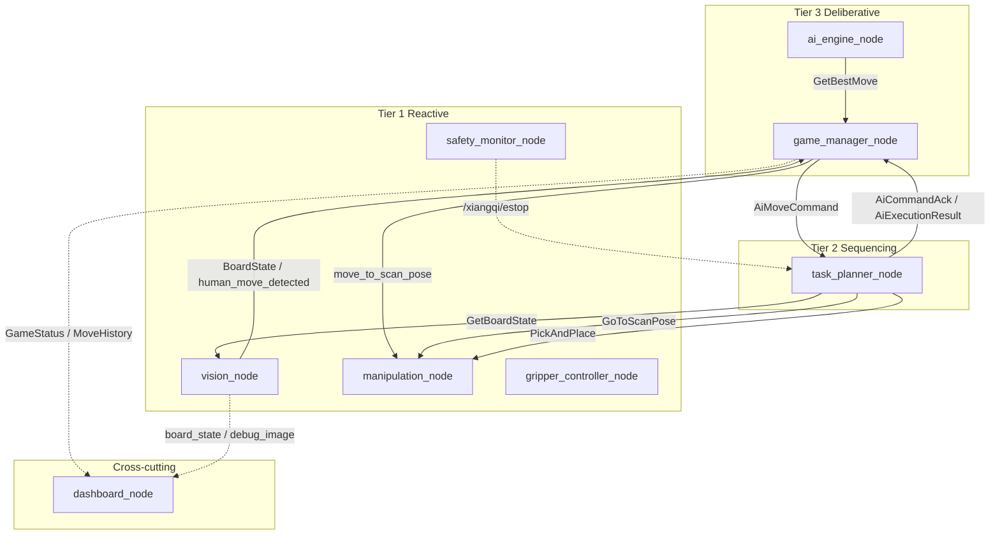

# Autonomous Xiangqi-Playing UR5e Cobot

Autonomous Chinese Chess (Xiangqi) on a **Universal Robots UR5e** with **OnRobot RG2** gripper, **Intel RealSense** on the arm (scan pose), and a **three-tier** ROS 2 Humble stack. Deployed in the **VXLab** Docker workflow ([UR5e_Env](https://github.com/Kibibibit/UR5e_Env)).

**Status (May 2026):** Full sim loop (dashboard, AI vs AI / AI vs Human); hardware loop (vision → AI → pick-and-place → verify); Fairy-Stockfish + custom minimax; behaviour-tree task planner. Open work: vision stability under some lighting, fine placement tuning, formal evaluation runs — see [.cursor/plans/xiangqi_robot_system_plan_64c0c1b9.plan.md](.cursor/plans/xiangqi_robot_system_plan_64c0c1b9.plan.md).

---

## Repository layout

| Path | Purpose |
|------|---------|
| [`workspace/src/`](workspace/src/) | Seven ROS 2 packages (see below) |
| [`workspace/config/`](workspace/config/) | Runtime `board_calibration.yaml` (created by `calibration_tool`) |
| [`workspace/models/`](workspace/models/) | Lab YOLO weights (`vision_config.yaml` → typically `xiangqi_kaggle_v4_best.pt`) |
| [`workspace/src/xiangqi_vision/models/`](workspace/src/xiangqi_vision/models/) | Bundled `xiangqi_kaggle_v1_best.pt` for sim / offline |
| [`tools/`](tools/) | Board SVG, dataset merge, YOLO training, sim Docker scripts |
| [`docs/`](docs/) | Printing, vision training, sim mode, rubric checklist — [docs/README.md](docs/README.md) |
| [`Dockerfile`](Dockerfile) | Image layer: Fairy-Stockfish, Ultralytics, pyffish, Flask, py_trees |
| [`UR5e_Env-main/`](UR5e_Env-main/) | **Reference only** — not for running the arm ([REFERENCE_NOTE.md](UR5e_Env-main/REFERENCE_NOTE.md)) |
| [`ur5evxlabdoc.md`](ur5evxlabdoc.md) | Lab IPs, Docker, pendant |
| [`assignment.md`](assignment.md) | Course brief |
| [`docs/assignment_rubric_checklist.md`](docs/assignment_rubric_checklist.md) | §4.8 mapping and report checklist |

---

## VXLab hardware

| Device | Typical access |
|--------|----------------|
| Dev box | `10.234.7.84`, Docker, ROS 2 Humble |
| UR5e | `10.234.6.49`, external control port `50002` |
| RG2 (EyeBox) | `10.234.6.47`, Modbus TCP |
| RealSense | USB3 — mounted on arm; board viewed from **scan pose** |

Start **before** Xiangqi launch (inside UR5e_Env container):

```bash
arm_drivers          # arm + gripper + camera
moveit_config_driver # MoveIt + lab action servers
```

Aliases live in upstream `workspace/.helper_scripts/helper-aliases.sh` (older docs may say `ur_driver`).

---

## Architecture

**Deliberative:** `game_manager_node`, `ai_engine_node` — FEN, human inference (pyffish), AI dispatch.  
**Sequencing:** `task_planner_node` — py_trees BT: capture, pick-and-place, scan pose, verify.  
**Reactive:** `vision_node`, `manipulation_node`, `gripper_controller_node`, `safety_monitor_node`.  
**Cross-cutting:** `dashboard_node` — Flask + Socket.IO.

`move_translator.py` is a **library** (not a node): grid → poses/joints from `board_calibration.yaml`.



**Launch (Xiangqi only):** `ros2 launch xiangqi_bringup xiangqi_system.launch.py`  
**Nodes:** vision, manipulation, gripper, safety, planner, ai (game + engine), dashboard.

Per-package detail: `workspace/src/*/README.md`.

---

## ROS 2 packages

| Package | Tier | Role |
|---------|------|------|
| `xiangqi_msgs` | — | Messages, services, actions |
| `xiangqi_bringup` | — | Launch + YAML config |
| `xiangqi_vision` | Reactive | ArUco + YOLO, calibration |
| `xiangqi_ai` | Deliberative | Game manager, engines |
| `xiangqi_planner` | Sequencing | Behaviour tree |
| `xiangqi_manipulation` | Reactive | Pick-and-place, RG2, safety |
| `xiangqi_dashboard` | Cross-cutting | Web UI |

### `xiangqi_msgs` (summary)

- **msg:** `BoardState`, `GameStatus`, `MoveHistory`, `EngineInfo`, `PieceDetection`, `AiMoveCommand`, `AiCommandAck`, `AiExecutionResult`
- **srv:** `GetBoardState`, `GetBoardTransform`, `GetBestMove`, `GripperControl`, `SetEngine`
- **action:** `PickAndPlace`, `ExecuteMove` (BT uses `PickAndPlace` + `AiMoveCommand`)

---

## Quick start (lab Docker)

Use a real [UR5e_Env](https://github.com/Kibibibit/UR5e_Env) checkout on the lab machine — not `UR5e_Env-main/` in this repo.

### 1. Images

```bash
cd ~/UR5e_Env && ./docker-build.sh
docker build -f /path/to/par_ur5e_xiangqi/Dockerfile -t ur5e_xiangqi:latest .
```

Point `docker-compose.yml` `ros2` service at `ur5e_xiangqi:latest`, then `./docker-start.sh` and `./docker-attach.sh`.

### 2. Install packages

```bash
cp -r /path/to/par_ur5e_xiangqi/workspace/src/* ~/workspace/src/
cd ~/workspace && build_workspace
```

### 3. Calibrate board

```bash
ros2 run xiangqi_vision calibration_tool
```

Teach scan pose, ArUco capture (**SPACE**), four corners + joint poses, graveyard zones. Saves to `/home/rosuser/workspace/config/board_calibration.yaml`. Match `grid_spacing_mm` to your printed mat ([board_printing_guide](docs/board_printing_guide.md)).

### 4. YOLO weights

Copy lab weights to `/home/rosuser/workspace/models/` (see [workspace/models/README.md](workspace/models/README.md)). Default in `vision_config.yaml`: **`xiangqi_kaggle_v4_best.pt`**. Sim can use package `xiangqi_kaggle_v1_best.pt`.

### 5. Verify vision

```bash
# With drivers + vision running
ros2 topic echo /xiangqi/board_state --once
# rqt_image_view /xiangqi/debug_image
```

Tune `confidence_threshold`, `grid_smooth_frames`, and optional `piece_preprocess_*` in `vision_config.yaml`.

### 6. Run stack

```bash
arm_drivers
moveit_config_driver   # separate terminal
ros2 launch xiangqi_bringup xiangqi_system.launch.py
```

Dashboard: **`http://<dev-box-ip>:5000/`** — configure engines, **Start Game**.

---

## Simulation (no robot)

```bash
# From repo root (host)
tools/wsl_docker_sim_run.sh
# Browser: http://127.0.0.1:5000/
```

Or inside a container:

```bash
ros2 launch xiangqi_bringup xiangqi_sim.launch.py
```

| | Simulation | Hardware |
|---|--------------|----------|
| Board state | Logical FEN + dashboard | Camera + YOLO + calibration |
| Human input | Dashboard clicks | Physical pieces + vision |
| Robot moves | Instant | Arm pick-and-place |
| AI vs AI | Yes | Yes |
| AI vs Human | Yes | Yes |

Details: [docs/sim_mode.md](docs/sim_mode.md), **§8b** below for Docker troubleshooting.

### Sim Docker (condensed)

```bash
docker build -f Dockerfile --build-arg BASE_IMAGE=ros:humble -t ur5e_xiangqi:latest .
tools/wsl_docker_sim_run.sh
```

Verify: `python3 tools/verify_api_pyffish.py http://127.0.0.1:5000/`

---

## AI engines

| Engine | Implementation |
|--------|----------------|
| **Fairy-Stockfish** | UCI subprocess, Xiangqi variant, skill 1–20 |
| **Minimax** | Iterative deepening, alpha–beta, `evaluation.py`; legality via pyffish |

Switch via dashboard, `SetEngine`, or launch `engine_type:=fairystockfish|minimax`.

---

## Report / course alignment

Three-tier justification, original vs third-party components, and §4.8 mapping: [docs/assignment_rubric_checklist.md](docs/assignment_rubric_checklist.md) and the [system plan](.cursor/plans/xiangqi_robot_system_plan_64c0c1b9.plan.md) §12–13.

**Original work (examples):** calibration pipeline, vision integration, human move inference, minimax engine, BT orchestration, manipulation bridge, dashboard, ROS package layout.  
**Dependencies:** Ultralytics YOLO, Fairy-Stockfish, pyffish, OpenCV ArUco, py_trees, VXLab MoveIt/RG2 drivers.

---

## Key files

| File | Role |
|------|------|
| `xiangqi_bringup/config/*.yaml` | Runtime parameters |
| `xiangqi_vision/board_detector.py` | ArUco + homography |
| `xiangqi_vision/piece_detector.py` | YOLO class map |
| `xiangqi_ai/game_manager_node.py` | Game FSM |
| `xiangqi_ai/minimax_engine.py` | Custom engine |
| `xiangqi_planner/task_planner_node.py` | Behaviour tree |
| `xiangqi_manipulation/manipulation_node.py` | Pick-and-place + scan pose |
| `xiangqi_manipulation/move_translator.py` | Grid → joints/poses |

---

## References

- [Star-Robot/chinese-chess-robot](https://github.com/Star-Robot/chinese-chess-robot) — dataset / detection inspiration  
- [fairy-stockfish/Fairy-Stockfish](https://github.com/fairy-stockfish/Fairy-Stockfish)  
- [Kibibibit/UR5e_Env](https://github.com/Kibibibit/UR5e_Env) — VXLab base environment  
