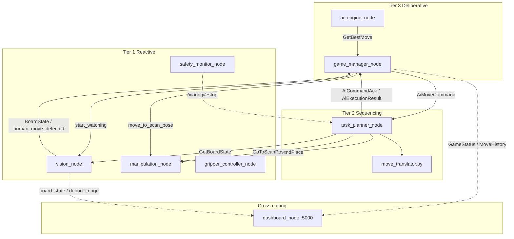
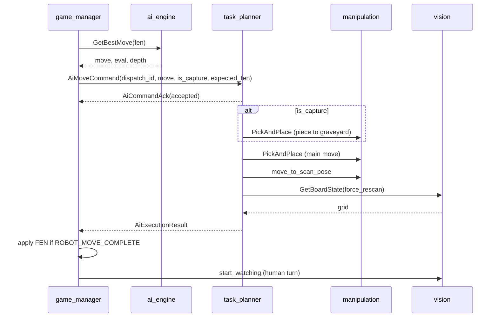
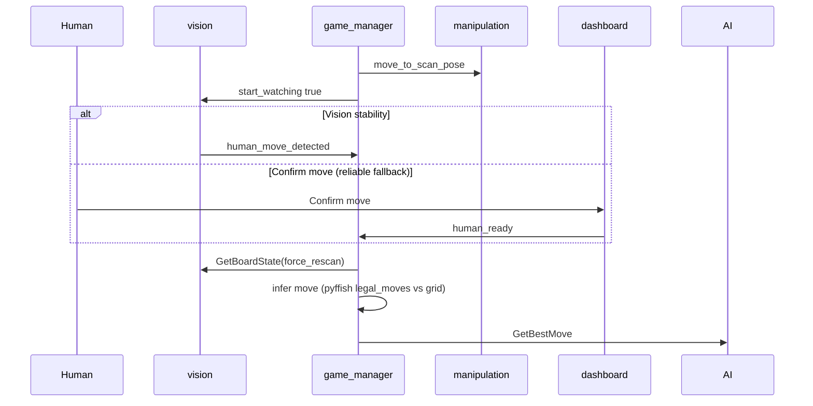

# Autonomous Xiangqi-Playing UR5e Cobot

Autonomous Chinese Chess (Xiangqi) on a **Universal Robots UR5e** with **OnRobot RG2** gripper, **Intel RealSense** on the arm (top-down **scan pose**), and a **three-tier** ROS 2 Humble stack. Deployed in the **VXLab** Docker workflow ([UR5e_Env](https://github.com/Kibibibit/UR5e_Env)).

This document is the **single system reference**: architecture, interfaces, behaviour, setup, and current status. Per-package detail: `workspace/src/*/README.md`. Topic-specific guides: [docs/README.md](docs/README.md).

---

## Table of contents

1. [Project status](#project-status)
2. [Repository layout](#repository-layout)
3. [Lab environment](#lab-environment)
4. [Software architecture](#software-architecture)
5. [ROS 2 packages](#ros-2-packages)
6. [Interfaces (`xiangqi_msgs`)](#interfaces-xiangqi_msgs)
7. [Topics and services catalog](#topics-and-services-catalog)
8. [End-to-end flows](#end-to-end-flows)
9. [Vision pipeline](#vision-pipeline)
10. [Game manager and AI engines](#game-manager-and-ai-engines)
11. [Task planner (behaviour tree)](#task-planner-behaviour-tree)
12. [Manipulation and calibration](#manipulation-and-calibration)
13. [Web dashboard](#web-dashboard)
14. [Physical setup](#physical-setup)
15. [Quick start (hardware)](#quick-start-hardware)
16. [Simulation mode](#simulation-mode)
17. [Implementation status and known gaps](#implementation-status-and-known-gaps)
18. [Original work vs dependencies](#original-work-vs-dependencies)
19. [Key source files](#key-source-files)
20. [References](#references)

---

## Project status

**Working (May 2026):**

- Full **simulation** game loop via web dashboard (AI vs AI, AI vs Human).
- **Hardware** loop: ArUco + YOLO vision → AI move → behaviour-tree pick-and-place → board verify.
- **Fairy-Stockfish** and **custom minimax** engines (UG second algorithm).
- **py_trees** task planner with capture, graveyard, scan pose, verify/retry.

**Open work:**

- YOLO grid **jitter** under some lighting (dashboard flicker, human-move inference).
- Small **XY placement** offsets on some board cells (calibration / joint teach-in tuning).

---

## Repository layout

| Path | Purpose |
|------|---------|
| [`workspace/src/`](workspace/src/) | Seven ROS 2 packages |
| [`workspace/config/`](workspace/config/) | Runtime `board_calibration.yaml` (from `calibration_tool`) |
| [`workspace/models/`](workspace/models/) | Lab YOLO weights (see [workspace/models/README.md](workspace/models/README.md)) |
| [`workspace/src/xiangqi_vision/models/`](workspace/src/xiangqi_vision/models/) | Bundled `xiangqi_kaggle_v1_best.pt` for sim |
| [`tools/`](tools/) | Board SVG, dataset merge, YOLO training, sim Docker scripts |
| [`docs/`](docs/) | Printing, vision training, sim troubleshooting |
| [`Dockerfile`](Dockerfile) | Extends UR5e_Env: Fairy-Stockfish, Ultralytics, pyffish, Flask, py_trees |
| [`UR5e_Env-main/`](UR5e_Env-main/) | **Reference only** — not for running the arm |
| [`ur5evxlabdoc.md`](ur5evxlabdoc.md) | Lab IPs, Docker, pendant |

---

## Lab environment

| Device | Typical access |
|--------|----------------|
| Dev box | `10.234.7.84`, Docker, ROS 2 Humble |
| UR5e | `10.234.6.49`, external control port `50002` |
| RG2 (EyeBox) | `10.234.6.47`, Modbus TCP |
| RealSense | USB3 on arm — board imaged from **scan pose** |

**Before** launching Xiangqi (inside UR5e_Env container):

```bash
arm_drivers          # UR5e + RG2 + camera
moveit_config_driver # MoveIt + /move_action + /par_moveit/waypoint_move
```

Aliases: `workspace/.helper_scripts/helper-aliases.sh` in UR5e_Env (older docs may say `ur_driver`).

All project packages live under `~/workspace/src/`. Build with `build_workspace`. The lab Connect-4 stack in `par_pkg` is a reference for pick-and-place patterns only.

---

## Software architecture

### Three-tier design

| Tier | Nodes | Responsibility |
|------|-------|----------------|
| **Deliberative** | `game_manager_node`, `ai_engine_node` | FEN, rules (pyffish), human move inference, AI search, dispatch robot moves |
| **Sequencing** | `task_planner_node` | py_trees BT: capture, pick-and-place, scan, verify, retries |
| **Reactive** | `vision_node`, `manipulation_node`, `gripper_controller_node`, `safety_monitor_node` | Perception, motion, gripper, e-stop |
| **Cross-cutting** | `dashboard_node` | Flask + Socket.IO HMI |

**Design choices:**

- **`move_translator.py` is not a ROS node** — a library used by the BT (`SetupMoveCoordinates`) and loaded from the same `board_calibration.yaml` as vision.
- **Human move detection lives in `game_manager_node`**, not the BT. The BT runs only after `/xiangqi/ai_move_command`.
- **VXLab drivers are outside** `xiangqi_system.launch.py`.

**Why three tiers (vs SPA or pure subsumption):** deliberation (chess-scale search and FEN) stays off the real-time perception/control path; the BT encodes multi-step motion (capture → move → scan → verify) without a monolithic FSM; reactive nodes stay simple and reusable.



**Launched by** `ros2 launch xiangqi_bringup xiangqi_system.launch.py`:

`vision_node`, `manipulation_node`, `gripper_controller_node`, `safety_monitor_node`, `task_planner_node`, `ai_engine_node`, `game_manager_node`, `dashboard_node`.

---

## ROS 2 packages

```
workspace/src/
  xiangqi_msgs/         # Messages, services, actions
  xiangqi_bringup/      # Launch + YAML config
  xiangqi_vision/       # ArUco, YOLO, calibration_tool
  xiangqi_ai/           # game_manager_node, ai_engine_node
  xiangqi_planner/      # task_planner_node + behaviours
  xiangqi_manipulation/ # manipulation, gripper, safety, move_translator
  xiangqi_dashboard/    # dashboard_node
```

| Package | README |
|---------|--------|
| `xiangqi_msgs` | [workspace/src/xiangqi_msgs/README.md](workspace/src/xiangqi_msgs/README.md) |
| `xiangqi_bringup` | [workspace/src/xiangqi_bringup/README.md](workspace/src/xiangqi_bringup/README.md) |
| `xiangqi_vision` | [workspace/src/xiangqi_vision/README.md](workspace/src/xiangqi_vision/README.md) |
| `xiangqi_ai` | [workspace/src/xiangqi_ai/README.md](workspace/src/xiangqi_ai/README.md) |
| `xiangqi_planner` | [workspace/src/xiangqi_planner/README.md](workspace/src/xiangqi_planner/README.md) |
| `xiangqi_manipulation` | [workspace/src/xiangqi_manipulation/README.md](workspace/src/xiangqi_manipulation/README.md) |
| `xiangqi_dashboard` | [workspace/src/xiangqi_dashboard/README.md](workspace/src/xiangqi_dashboard/README.md) |

---

## Interfaces (`xiangqi_msgs`)

Field-level definitions: `workspace/src/xiangqi_msgs/msg|srv|action/`.

### Messages

| Message | Purpose |
|---------|---------|
| `BoardState` | `int8[90]` grid (`rank * 9 + file`, rank 0 = Red); `±1…±7` piece types; optional FEN; mean YOLO confidence |
| `GameStatus` | FSM string, `current_fen`, `engine_type`, `game_result` / `game_result_reason` |
| `MoveHistory` | Move log: coordinate move, side, depth, `evaluation_cp`, `thinking_time_sec`, `engine_used` |
| `EngineInfo` | Live AI telemetry for dashboard |
| `PieceDetection` | Single detection record |
| `AiMoveCommand` | `dispatch_id`, `move`, `is_capture`, `expected_fen` |
| `AiCommandAck` | `dispatch_id`, `accepted`, `reason` |
| `AiExecutionResult` | `dispatch_id`, `status`, `message` |

`AiExecutionResult.status`: `ROBOT_MOVE_COMPLETE` | `BOARD_VERIFY_FAILED` | `AI_MOTION_FAILED`.

### Services

| Service | Server | Purpose |
|---------|--------|---------|
| `GetBoardState` | `vision_node` | Snapshot; `force_rescan` runs fresh pipeline |
| `GetBoardTransform` | `vision_node` | Board transform helper |
| `GetBestMove` | `ai_engine_node` | FEN + depth/time → move + stats |
| `SetEngine` | `ai_engine_node` | `fairystockfish` \| `minimax` + difficulty |
| `GripperControl` | `gripper_controller_node` | Width (mm), force (N) |

**Standard services:** `manipulation_node` exposes `std_srvs/Trigger` on `/xiangqi/move_to_scan_pose` and `/xiangqi/move_to_initial_pose`.

### Actions

| Action | Server | Purpose |
|--------|--------|---------|
| `PickAndPlace` | `manipulation_node` | **Primary motion** — pick/place poses, approach/transit heights |
| `ExecuteMove` | *(defined, unused in live BT)* | Higher-level move string; stack uses `PickAndPlace` + `AiMoveCommand` |

### External lab interfaces

| Interface | Type | Name |
|-----------|------|------|
| Move group | action | `/move_action` |
| Cartesian waypoint | action | `/par_moveit/waypoint_move` |
| RG2 | action | `/rg2/set_width` |
| UR safety | topic | `/ur_hardware_interface/safety_mode` |

---

## Topics and services catalog

Topics are under `/xiangqi/` unless noted.

| Topic | Type | Publisher | Main subscribers |
|-------|------|-----------|------------------|
| `board_state` | `BoardState` | `vision_node`, `game_manager` (sim) | `game_manager`, `dashboard` |
| `human_move_detected` | `Bool` | `vision_node` | `game_manager` |
| `start_watching` | `Bool` | `game_manager` | `vision_node` |
| `human_ready` | `Empty` | `dashboard` | `vision_node`, `game_manager` |
| `game_status` | `GameStatus` | `game_manager` | `dashboard`, `task_planner` |
| `move_history` | `MoveHistory` | `game_manager` | `dashboard` |
| `engine_info` | `EngineInfo` | `ai_engine` | `dashboard` |
| `ai_move_command` | `AiMoveCommand` | `game_manager` | `task_planner` |
| `ai_command_ack` | `AiCommandAck` | `task_planner` | `game_manager` |
| `ai_execution_result` | `AiExecutionResult` | `task_planner` | `game_manager` |
| `illegal_move_alert` | `String` | `game_manager`, BT | `dashboard` |
| `estop` | `Bool` | `safety_monitor` | `game_manager`, `task_planner` |
| `emergency_stop` | `Bool` | `dashboard` | `safety_monitor` |
| `safety_status` | `String` | `safety_monitor` | `dashboard` |
| `gripper_active` | `Bool` | `gripper_controller` | `dashboard` |
| `debug_image` | `Image` | `vision_node` | debug / RViz |
| `new_game`, `stop_game`, `reset_game` | `Empty` | `dashboard` | `game_manager` |
| `game_mode` | `String` | `dashboard` | `game_manager` (`ai_vs_ai` \| `ai_vs_human`) |
| `ai_engines` | `String` | `dashboard` | JSON red/black engine |
| `human_color` | `String` | `dashboard` | `red` \| `black` |
| `simulate_human_move` | `String` | `dashboard` | sim clicks only |
| `resync_from_vision` | `Empty` | `dashboard` | Sync board from vision |

**Camera (parameter):** `vision_node` subscribes to `/camera/camera/color/image_raw` by default (`vision_config.yaml`).

---

## End-to-end flows

### Robot move (hardware)



### Human turn (hardware)



### `game_manager_node` states

| Internal state | Meaning |
|----------------|---------|
| `IDLE` | No active game |
| `WAITING_HUMAN` | Opponent turn; vision watching |
| `DETECTING_MOVE` | Rescan + infer human move |
| `COMPUTING_AI` | Async `GetBestMove` in flight |
| `EXECUTING_MOVE` | Waiting for matching `AiExecutionResult` |
| `GAME_OVER` | Terminal |

Published `GameStatus.status` strings align with these phases.

### Simulation

With `simulation_mode:=true`, the game manager **applies AI moves in software** (no `AiMoveCommand` to the arm). Board state comes from pyffish + dashboard clicks. See [Simulation mode](#simulation-mode).

---

## Vision pipeline

### Board localization (every frame)

1. **ArUco** `DICT_4X4_50`, IDs **0–3** on the four **outer corners** of the printed sheet ([`tools/generate_board_svg.py`](tools/generate_board_svg.py)).
2. All four markers required → `cv2.findHomography` → warp to **800×890** top-down image.
3. **`grid_spacing_mm`** in calibration must match real intersection spacing on the mat.

The robot does **not** parse SVG lines; it uses a **9×10 grid index** consistent with pyffish and vision (`rank * 9 + file`, rank 0 = Red).

### Piece detection

- **YOLOv8** (Ultralytics) on the warped image; class map in `piece_detector.py`.
- Box centres → `(file, rank)` via `board_layout.pixel_to_grid`.
- Lab default weights: `xiangqi_kaggle_v4_best.pt` (`vision_config.yaml`). Package bundles `v1` for sim.

### Temporal stability

| Mechanism | Parameter | Role |
|-----------|-----------|------|
| `GridStabilizer` | `grid_smooth_frames` | Per-cell hold until N agreeing raw frames |
| `TurnDetector` | `stability_frames` | Human “move done” after stable grid |
| Dashboard hold | (in `dashboard_node`) | UI ignores single-frame grid flips |

Tune `confidence_threshold`, `grid_smooth_frames`, and optional `piece_preprocess_*` when lighting is poor. Experiment node: `vision_preprocess_experiment` — see [xiangqi_vision/README.md](workspace/src/xiangqi_vision/README.md).

### Human move inference (game manager)

Not in vision: after a stable board change, `game_manager_node` tries each **pyffish legal move**, converts resulting FEN to grid, and picks the match (`human_move_grid_tolerance` for fuzzy YOLO). Invalid or ambiguous grids → `illegal_move_alert`, return to watching.

### Calibration tool

`ros2 run xiangqi_vision calibration_tool`:

1. Teach **scan pose** (joint positions for homing).
2. Capture ArUco homography (**SPACE**).
3. Teach four **corner intersections** + per-cell **approach/grasp joints** (and optional e-file / rank midpoints for 4-patch interpolation).
4. Teach **graveyard** approach/grasp joints per side.

Output: `/home/rosuser/workspace/config/board_calibration.yaml`.

Guides: [docs/board_printing_guide.md](docs/board_printing_guide.md), [docs/vision_training_guide.md](docs/vision_training_guide.md).

---

## Game manager and AI engines

### Modes

| Mode | Hardware | Simulation |
|------|----------|------------|
| **AI vs Human** | Human moves pieces; robot plays other color | Human clicks board |
| **AI vs AI** | Robot plays both sides (full arm loop) | Instant FEN updates |

### Engines (same `GetBestMove` service)

| Engine | Implementation |
|--------|----------------|
| **Fairy-Stockfish** | UCI subprocess, `UCI_Variant xiangqi`, skill 1–20 |
| **Minimax** | Iterative deepening, alpha–beta, `evaluation.py`; legality via **pyffish** |

Switch: dashboard, `SetEngine`, or launch `engine_type:=fairystockfish|minimax`.

**Config** (`game_config.yaml`): `ai_time_limit` (5 s hardware), `sim_ai_time_limit` (3 s), `trust_robot_move_after_verify_fail`, `minimax_nnue_display_eval` (shallow FSF eval for dashboard bar when using minimax).

### Dispatch protocol

1. Game manager calls `GetBestMove` **without** applying the AI move to FEN yet.
2. Publishes `AiMoveCommand` with monotonic `dispatch_id` and `expected_fen` after the move.
3. Waits for `AiCommandAck` then `AiExecutionResult` with the **same** `dispatch_id`.
4. On `ROBOT_MOVE_COMPLETE` → commit FEN. On failure / e-stop → discard pending move.

---

## Task planner (behaviour tree)

Ticks at **10 Hz** when blackboard `ai_move` is set.

```
Root (Sequence)
  └── NotEstopped
        └── Selector MotionOrAbortReport
              ├── Sequence MoveSequence
              │     ├── SetupMoveCoordinates   (move_translator → poses)
              │     ├── CaptureOrSkip          (graveyard PickAndPlace if is_capture)
              │     ├── PickAIPiece            (main PickAndPlace)
              │     ├── GoToScanPose           (FailureIsSuccess)
              │     ├── VerifyBestEffort       (Retry VerifyBoardState ×5)
              │     └── FinalizeRobotMoveAfterVerify
              └── AiMotionFailureFinalizer     (AI_MOTION_FAILED)
```

Verify compares vision grid to `expected_fen` within `verify_grid_tolerance` (`planner_config.yaml`).

---

## Manipulation and calibration

### Pick-and-place sequence

Open gripper → approach pick → grasp → lift → transit → approach place → place → release → lift clear.

### Motion backends (hardware)

| Phase | Method |
|-------|--------|
| Scan / homing | Joint `/move_action` from `scan_joint_positions` |
| Board cells (preferred) | **4-patch bilinear joint interpolation** from taught corner + midpoint joints |
| Fallback | OMPL `/move_action` + vertical `/par_moveit/waypoint_move` |
| Gripper | `/rg2/set_width` |

`move_translator` maps coordinate moves (`h0g2`) to pick/place poses and joint targets using the same YAML as vision.

### Safety

`safety_monitor_node` ORs dashboard e-stop and UR protective stop → `/xiangqi/estop`. BT and game manager abort in-flight work on e-stop.

Smoke test: `ros2 run xiangqi_manipulation test_moveit_move --move e5 e7`

---

## Web dashboard

- **URL:** `http://<host>:5000/`
- **Features:** live board, move history, eval bar, engine setup, AI vs AI / AI vs Human, e-stop, Confirm move, Sync board (hardware), illegal-move toasts.
- **Architecture:** `dashboard_node` bridges ROS ↔ Flask + Socket.IO; grid hold reduces YOLO flicker in the UI.

API examples: `POST /api/new_game`, `/api/human_ready`, `/api/set_engines`, `/api/legal_moves` (sim only).

---

## Physical setup

- **Board mat:** A2/A3 SVG with ArUco at sheet corners — [docs/board_printing_guide.md](docs/board_printing_guide.md).
- **Pieces:** ~20 mm diameter lab set; RG2 side grasp.
- **Graveyard:** two off-board zones taught in calibration.
- **Reach:** UR5e base placed so board + graveyards are within workspace.
- **Lighting:** diffuse light reduces ArUco glare and YOLO flicker.

---

## Quick start (hardware)

Use a real [UR5e_Env](https://github.com/Kibibibit/UR5e_Env) checkout — not `UR5e_Env-main/` in this repo.

### 1. Docker images

```bash
cd ~/UR5e_Env && ./docker-build.sh
docker build -f /path/to/par_ur5e_xiangqi/Dockerfile -t ur5e_xiangqi:latest .
```

Set `docker-compose.yml` `ros2` service image to `ur5e_xiangqi:latest`, then `./docker-start.sh` and `./docker-attach.sh`.

### 2. Install and build

```bash
cp -r /path/to/par_ur5e_xiangqi/workspace/src/* ~/workspace/src/
cd ~/workspace && build_workspace
```

### 3. Calibrate

```bash
ros2 run xiangqi_vision calibration_tool
```

### 4. YOLO weights

```bash
# On lab PC
scp workspace/models/xiangqi_kaggle_v4_best.pt vxlab@10.234.7.84:/home/rosuser/workspace/models/
```

### 5. Run

```bash
arm_drivers
moveit_config_driver   # other terminal
ros2 launch xiangqi_bringup xiangqi_system.launch.py
```

Open dashboard → configure engines → **Start Game**.

---

## Simulation mode

No `arm_drivers` or `moveit_config_driver` required.

```bash
# Host (WSL/Linux)
tools/wsl_docker_sim_run.sh
# http://127.0.0.1:5000/
```

Or in container:

```bash
ros2 launch xiangqi_bringup xiangqi_sim.launch.py
```

| | Simulation | Hardware |
|---|------------|----------|
| Board | pyffish FEN + dashboard | Camera + YOLO |
| Human | Board clicks | Physical pieces + vision |
| Robot moves | Instant | Pick-and-place |
| Modes | AI vs AI, AI vs Human | AI vs AI, AI vs Human |

Full guide: [docs/sim_mode.md](docs/sim_mode.md).

Verify: `python3 tools/verify_api_pyffish.py http://127.0.0.1:5000/`

---

## Implementation status and known gaps

| Area | Status | Notes |
|------|--------|-------|
| ROS packages + launch | Done | 7 packages |
| Vision ArUco + YOLO | Done; fragile in bad light | Tune `grid_smooth_frames`, preprocess, retrain |
| Human move inference | Done | Needs stable `BoardState` |
| FSF + minimax | Done | Optional NNUE via env |
| BT + PickAndPlace + graveyard | Done | `dispatch_id` protocol |
| Dashboard | Done | Grid hold + Confirm move fallback |
| End-to-end hardware games | Works | Occasional verify fail / placement offset |
| Evaluation experiments | Planned | Detection, placement, full-game metrics |
| `ExecuteMove` action | Defined only | Not used in live BT |

**Practical human-turn path today:** **Confirm move** on the dashboard (or `/xiangqi/human_ready`) when vision stability is noisy; auto stability detection is implemented for tuning.

---

## Original work vs dependencies

### Implemented here (cite in reports)

- Custom **minimax** engine (`minimax_engine.py`, `evaluation.py`) with pyffish legality.
- **Human move inference** via board-state differencing + pyffish validation.
- **Calibration pipeline** (ArUco, homography, joint teach-in, graveyard).
- **Vision integration** (`vision_node`, `GridStabilizer`, turn detection).
- **Game orchestration** FSM and `AiMoveCommand` / `AiExecutionResult` protocol.
- **Behaviour tree** (capture, verify, scan pose, failure finalizers).
- **Manipulation bridge** (`PickAndPlace`, joint interpolation, scan pose services).
- **ROS infrastructure** (`xiangqi_msgs`, bringup, Dockerfile, dashboard).
- **Three-tier** package split and explicit interfaces.

### Third-party / lab (acknowledge, do not claim as original algorithms)

- Ultralytics **YOLOv8**, **Fairy-Stockfish**, **pyffish**, OpenCV **ArUco**, **py_trees**, VXLab **MoveIt** / **RG2** / **RealSense** drivers.

---

## Key source files

| File | Role |
|------|------|
| `xiangqi_bringup/config/*.yaml` | Runtime parameters |
| `xiangqi_vision/board_detector.py` | ArUco + homography |
| `xiangqi_vision/vision_node.py` | Perception loop + stabilizer |
| `xiangqi_vision/piece_detector.py` | YOLO class map |
| `xiangqi_ai/game_manager_node.py` | Game FSM |
| `xiangqi_ai/minimax_engine.py` | Custom engine |
| `xiangqi_planner/task_planner_node.py` | Behaviour tree |
| `xiangqi_manipulation/manipulation_node.py` | Pick-and-place |
| `xiangqi_manipulation/move_translator.py` | Grid → joints/poses |

---

## References

- [Star-Robot/chinese-chess-robot](https://github.com/Star-Robot/chinese-chess-robot) — dataset / detection approach  
- [fairy-stockfish/Fairy-Stockfish](https://github.com/fairy-stockfish/Fairy-Stockfish)  
- [Kibibibit/UR5e_Env](https://github.com/Kibibibit/UR5e_Env) — VXLab base environment  
