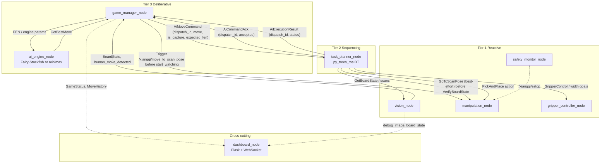

# Autonomous Xiangqi-Playing UR5e Cobot

A fully autonomous robotic system that plays Chinese Chess (Xiangqi) against a human opponent using a Universal Robots UR5e collaborative arm, an overhead Intel RealSense camera, an **OnRobot RG2 two-finger parallel gripper** (Modbus TCP via the lab EyeBox), and a **three-tier** hierarchical software stack in **ROS 2 Humble**. Development and deployment target the **VXLab (Virtual Experiences Laboratory)** Docker workflow based on [Kibibibit/UR5e_Env](https://github.com/Kibibibit/UR5e_Env).

---

## What is in this repository

| Path | Purpose |
|------|---------|
| [`workspace/src/`](workspace/src/) | Six ROS 2 packages: `xiangqi_msgs`, `xiangqi_bringup`, `xiangqi_vision`, `xiangqi_ai`, `xiangqi_planner`, `xiangqi_manipulation`, `xiangqi_dashboard` |
| [`workspace/config/`](workspace/config/) | **Runtime** calibration output (`board_calibration.yaml` after `calibration_tool`); created on first save; bind-mounted with the workspace in Docker |
| [`workspace/src/xiangqi_vision/models/`](workspace/src/xiangqi_vision/models/) | YOLO weights (`xiangqi_kaggle_v1_best.pt`, tracked in git); optional copy at `workspace/models/` for lab `vision_config.yaml` |
| [`tools/`](tools/) | Host-side Python helpers for board SVG generation, dataset merge, Kaggle/local YOLO training, and prediction previews (see [docs/README.md](docs/README.md)) |
| [`docs/`](docs/) | Printing and vision guides, generated board SVGs (`board_mat_*.svg`), and geometry YAML used with `generate_board_svg.py` |
| [`Dockerfile`](Dockerfile) | Extends the UR5e_Env image with Fairy-Stockfish, Ultralytics, pyffish, Flask dashboard stack, py_trees, OpenCV, etc. |
| [`UR5e_Env-main/`](UR5e_Env-main/) | **Reference only** (not for running Docker or the arm): frozen snapshot of the VXLab base stack — see [`UR5e_Env-main/REFERENCE_NOTE.md`](UR5e_Env-main/REFERENCE_NOTE.md). Inspect `par_pkg`, drivers, MoveIt, RG2; integration checklist in [`docs/ur5e_env_alignment.md`](docs/ur5e_env_alignment.md). For deployment use a proper [`UR5e_Env`](https://github.com/Kibibibit/UR5e_Env) checkout. |
| [`ur5evxlabdoc.md`](ur5evxlabdoc.md) | Lab onboarding: dev box / arm / gripper / camera IPs, Docker steps, pendant setup |
| [`.cursor/plans/xiangqi_robot_system_plan_64c0c1b9.plan.md`](.cursor/plans/xiangqi_robot_system_plan_64c0c1b9.plan.md) | Full system design (three tiers, vision/AI/manipulation, rubric “original work” items, experiment ideas). Implementation follows this plan; end-to-end integration experiments are still listed as open there. |
| [`assignment.md`](assignment.md) | Course brief: §4.8 project definition, report rules (§6), shared/UG/PG requirements, rubric themes (§8) |
| [`docs/assignment_rubric_checklist.md`](docs/assignment_rubric_checklist.md) | §4.8 mapping, report checklist, rubric-oriented readiness (detail kept out of this README) |

---

## VXLab environment (hardware and base software)

From [`ur5evxlabdoc.md`](ur5evxlabdoc.md) and the upstream [UR5e_Env README](https://github.com/Kibibibit/UR5e_Env/blob/main/README.md) (same text is mirrored under [`UR5e_Env-main/README.md`](UR5e_Env-main/README.md) for offline reference only):

- **Dev box** (typical IP `10.234.7.84`) — Ubuntu, Docker, ROS 2 Humble inside the container
- **UR5e** — controller (typical IP `10.234.6.49`, **External Control** port `50002`)
- **OnRobot RG2** — EyeBox (typical IP `10.234.6.47`), Modbus TCP; the running lab image includes `onrobot_rg2_driver` from UR5e_Env (layout visible in the reference tree under `UR5e_Env-main/workspace/src/onrobot_rg2_driver/`)
- **RealSense** — USB3 to the dev box

Inside the **actual** UR5e_Env container, common **aliases** are defined in the upstream workspace (see **`workspace/.helper_scripts/helper-aliases.sh`** in a UR5e_Env clone; some older docs mention `testing_scripts/`) and include:

- `arm_drivers` — UR arm, gripper, and camera drivers (RViz optional; `--no-rviz`, `--no-gripper` supported)
- `moveit_config_driver` — MoveIt 2 and the lab’s custom MoveIt action server
- `realsense_driver` / `find_object_2d` — camera-only or Find-Object workflow (Connect 4 demo)

**Note:** Some older lab notes may say `ur_driver`; the current `UR5e_Env` README uses **`arm_drivers`** for the combined driver launch.

---

## System architecture

Three-tier layout (deliberative / sequencing / reactive) with an explicit ROS 2 graph. *Move translation* (grid → `base_link` poses) lives in [`move_translator.py`](workspace/src/xiangqi_manipulation/xiangqi_manipulation/move_translator.py) and is invoked from the behaviour tree, not as its own node.

For wrist-camera setups (RealSense on the end-effector), board scans are now **scan-pose gated**: the planner runs `GoToScanPose` before board verification, and the game manager requests `/xiangqi/move_to_scan_pose` before enabling human-turn watching. The scan pose is derived from `board_calibration.yaml` board centre when calibration is available, with parameter fallback if not.



**Launched nodes** (`xiangqi_system.launch.py`): `vision_node`, `manipulation_node`, `gripper_controller_node`, `safety_monitor_node`, `task_planner_node`, `ai_engine_node`, `game_manager_node`, `dashboard_node`.

Hardware drivers are **not** started by the Xiangqi launch file: start `arm_drivers` and `moveit_config_driver` first (VXLab convention).

---

## Project summary (methodology and report angle)

The work targets **course §4.8** (UR5e pick-and-place with planning) as a **2D game**: the arm must perceive the board, infer when the human has finished moving, compute legal robot moves, and execute pick-and-place including captures—without hand-authored move entry as the primary loop.

**Methodology (high level).** The software is organised as a **three-tier robot architecture** implemented in ROS 2 Humble: a *deliberative* layer holds game state and AI (`game_manager_node`, `ai_engine_node`); a *sequencing* layer runs a **py_trees** behaviour tree for multi-step moves, retries, and capture handling (`task_planner_node`); a *reactive* layer performs perception and motion (`xiangqi_vision`, `xiangqi_manipulation`). That split keeps slow search and rule validation off the hot path for sensing and control, while the middle tier encodes task structure that would be awkward in a single monolithic node or a purely reactive stack. The written report should state this design choice explicitly and contrast it briefly with alternatives (e.g. flat FSM, subsumption-only), using the mermaid figure above.

**Technical approach.** Perception combines **ArUco**-based board rectification with **YOLOv8** piece detection; moves are inferred by **board-state differencing** checked with **pyffish**. Manipulation uses the VXLab **MoveIt** waypoint action and **RG2** width goals. Two move generators satisfy the **multiple-algorithm** expectation for undergraduates: **Fairy-Stockfish** (UCI) and a **custom minimax** engine with alpha–beta pruning.

**Original scope (for the report — vs off-the-shelf components).** The rubric asks you to **delineate** team work from dependencies. The following matches the “original implementation” items in the [system plan](.cursor/plans/xiangqi_robot_system_plan_64c0c1b9.plan.md) (§12–13):

- **Designed and integrated here (cite files / nodes in the report):**
  - **Custom Xiangqi engine** — Iterative-deepening minimax with alpha–beta pruning, move ordering, and a hand-crafted evaluation (material, piece–square tables, king safety, mobility) in `minimax_engine.py` / `evaluation.py`; legal moves via **pyffish**, not a reimplementation of Xiangqi rules.
  - **Human move inference** — Board-state differencing from vision, validated against legal moves with **pyffish** (no generic ROS package provides this for Xiangqi).
  - **Board calibration pipeline** — ArUco + homography, grid/teach-in workflow, and persisted `board_calibration.yaml` (`calibration_tool`, `board_detector`).
  - **Vision integration** — `vision_node` wiring warp → YOLO → grid, turn / stability logic, debug output, and `GetBoardState`.
  - **Game orchestration** — Explicit FSM in `game_manager_node` (wait human → validate → AI → execute), topics/services for the planner and dashboard.
  - **Task planning** — Behaviour-tree structure for the full loop, captures, and verification/retry behaviour (`task_planner_node`, `xiangqi_planner/behaviours/`).
  - **Manipulation bridge** — `PickAndPlace` action server that sequences lab **WaypointMove** and **GripperSetWidth** goals with simulation vs hardware paths (`manipulation_node`); grid-to-pose **move_translator**; gripper and safety wrappers.
  - **ROS 2 infrastructure** — `xiangqi_msgs`, `xiangqi_bringup` launch/parameters, Dockerfile layer on UR5e_Env, Flask/SocketIO dashboard bridging ROS state.
  - **Three-tier enforcement** — Deliberative / sequencing / reactive responsibilities split across packages and the main launch file, with explicit interfaces (aligned with plan §12.5).
  - **Dataset / deployment workflow** — Host `tools/` scripts (SVG board generation, merge/capture/train/preview pipelines) and lab documentation for adapting YOLO weights to your mat and pieces.

- **Imported or stock (acknowledge and reference; do not claim as original algorithms):**
  - **Ultralytics YOLOv8** — Detector backbone and training API; you contribute data, labels, class mapping, and integration.
  - **Fairy-Stockfish** — Pre-existing engine; contribution is **UCI subprocess wrapper**, ROS service interface, and variant/skill configuration.
  - **pyffish** — Rule and FEN handling for validation and minimax legality.
  - **OpenCV** — ArUco/homography primitives; contribution is the **calibration and board pipeline** built on top.
  - **py_trees / py_trees_ros** — BT framework; contribution is the **tree design** and ROS behaviours.
  - **Lab stack** — `ur_robot_driver`, `realsense2_camera`, MoveIt 2, `par_moveit` action server, `onrobot_rg2_driver`: configured and **called from** `manipulation_node` / launch, not reimplemented.

Tables that map every §4.8 bullet to files, full §2/§6 report requirements, and a candid rubric readiness checklist are in **[`docs/assignment_rubric_checklist.md`](docs/assignment_rubric_checklist.md)**. The authoritative course text remains **[`assignment.md`](assignment.md)**.

---

## ROS 2 packages and executables

| Package | Tier | Executables / role |
|---------|------|---------------------|
| `xiangqi_msgs` | — | Messages, services, actions (see below) |
| `xiangqi_vision` | Reactive | `vision_node`, `calibration_tool` |
| `xiangqi_ai` | Deliberative | `game_manager_node`, `ai_engine_node` |
| `xiangqi_manipulation` | Reactive | `manipulation_node`, `gripper_controller_node`, `safety_monitor_node` |
| `xiangqi_planner` | Sequencing | `task_planner_node` |
| `xiangqi_dashboard` | Cross-cutting | `dashboard_node` |
| `xiangqi_bringup` | — | `launch/xiangqi_system.launch.py`, `launch/xiangqi_sim.launch.py`; config YAML under `config/` |

Each package under `workspace/src/` includes its own **`README.md`** with a logic-focused walkthrough of nodes and modules.

### `xiangqi_msgs` (actual definitions)

- **msg:** `BoardState`, `GameStatus`, `PieceDetection`, `MoveHistory`, `EngineInfo`
- **srv:** `GetBoardState`, `GetBestMove`, `GripperControl`, `SetEngine`
- **action:** `ExecuteMove`, `PickAndPlace`

---

## Quick start (VXLab Docker)

Use a real checkout of [UR5e_Env](https://github.com/Kibibibit/UR5e_Env) on the lab machine (e.g. `~/UR5e_Env` per [`ur5evxlabdoc.md`](ur5evxlabdoc.md)). The folder [`UR5e_Env-main/`](UR5e_Env-main/) in **this** repo is **reference-only**; do not use it as the Docker root for deployment.

### 1. Build the Docker images

**Base (VXLab UR5e_Env)** — from [`ur5evxlabdoc.md`](ur5evxlabdoc.md):

```bash
cd ~/UR5e_Env
./docker-build.sh
```

In the reference [`UR5e_Env-main/docker-compose.yml`](UR5e_Env-main/docker-compose.yml), the built image is tagged **`ros:humble`** (local tag; not `ur5e_env:latest`). Scripts such as [`docker-delete.sh`](UR5e_Env-main/docker-delete.sh) assume that name.

**Xiangqi layer** — extend that image with this repository’s Dockerfile. The Dockerfile defaults to **`FROM ros:humble`** so it picks up your **lab-built** image (context can be any directory; there is no `COPY` from context):

```bash
docker build \
  -f /path/to/par_ur5e_xiangqi/Dockerfile \
  -t ur5e_xiangqi:latest \
  .
```

If your lab renames the base image, pass an explicit base:

```bash
docker build -f /path/to/par_ur5e_xiangqi/Dockerfile --build-arg BASE_IMAGE=your_base:tag -t ur5e_xiangqi:latest .
```

**Run the extended image** — `docker-start.sh` uses `docker-compose.yml`, which by default still points at **`image: ros:humble`**. To actually run Fairy-Stockfish, YOLO, etc., either:

- Edit **`~/UR5e_Env/docker-compose.yml`**: under the `ros2` service, set **`image: ur5e_xiangqi:latest`** and **remove** (or comment out) the `build:` block so Compose does not rebuild the wrong image; then `./docker-start.sh`, **or**
- Use whatever override your lab uses to substitute the Xiangqi image name.

Then attach (from `~/UR5e_Env`, same as upstream):

```bash
cd ~/UR5e_Env
./docker-start.sh
./docker-attach.sh
```

### 2. Copy packages into the workspace

```bash
cp -r /path/to/par_ur5e_xiangqi/workspace/src/* ~/workspace/src/
```

(`~/workspace` is the usual mount inside the container.)

Optional: copy [`tools/`](tools/) if you want training and SVG scripts beside the workspace on the host.

### 3. Build the ROS 2 workspace

From a shell **inside** the container:

```bash
cd ~/workspace
build_workspace
```

### 4. Calibrate the board (one-time)

With the RealSense publishing **`/camera/color/image_raw`** (same topic as in `vision_config.yaml`):

```bash
ros2 run xiangqi_vision calibration_tool
```

Follow the on-screen steps: set **`grid_spacing_mm`** to match your printed mat (from `docs/board_geometry_A2.yaml` or `docs/board_geometry_A3.yaml` after running `tools/generate_board_svg.py`), capture ArUco with **SPACE**, then teach in the four board corners on the pendant.

Calibration is written to **`/home/rosuser/workspace/config/board_calibration.yaml`**. That path must match **`calibration_file`** in `vision_config.yaml`. The directory is created automatically on first save.

### 5. Train / place the YOLOv8 model

The default weights file **`xiangqi_kaggle_v1_best.pt`** is committed under `workspace/src/xiangqi_vision/models/` and installed to `share/xiangqi_vision/models/` after `colcon build`.

For **lab hardware**, you can still use the legacy path (set in `vision_config.yaml`):

```
/home/rosuser/workspace/models/xiangqi_kaggle_v1_best.pt
```

Copy or symlink from the package `models/` folder if needed. For a different filename, update that YAML or override at launch:

```bash
ros2 run xiangqi_vision vision_node --ros-args -p model_path:=/path/to/your.pt
```

Training: [docs/vision_training_guide.md](docs/vision_training_guide.md); scripted Kaggle flow: [tools/kaggle_train_xiangqi_yolo.py](tools/kaggle_train_xiangqi_yolo.py); tools index: [docs/README.md](docs/README.md).

### 6. Verify vision on hardware (after model + calibration)

With the vision stack running and the RealSense publishing:

- Overlaid detections: **`/xiangqi/debug_image`**
- Tune **`confidence_threshold`** in `vision_config.yaml` if boxes flicker or scores are wrong.

The node runs YOLO on the **ArUco-warped** board image. If quality on the real mat lags the dataset, capture more lab images and fine-tune (vision training guide).

### 7. Start the robot drivers (as usual)

```bash
arm_drivers
# (in new terminal)
moveit_config_driver
```

### 8. Launch the Xiangqi system

```bash
ros2 launch xiangqi_bringup xiangqi_system.launch.py
```

### 8b. Simulation mode (setup and instructions)

Use simulation to test **Xiangqi rules**, **Minimax / Fairy-Stockfish**, **AI vs AI**, and the **web dashboard** with **no UR5e, camera, MoveIt, or gripper**. Background (architecture, config tables, extended troubleshooting): **[docs/sim_mode.md](docs/sim_mode.md)**.

**Do not run** `arm_drivers` or `moveit_config_driver` for simulation.

#### Sim vs hardware (summary)

| | Simulation | Hardware (§7–8 above) |
|---|------------|------------------------|
| Board | Logical FEN (pyffish) + dashboard grid | Camera + YOLO + calibration |
| Your moves | Click on dashboard (AI vs Human) | Move pieces on the mat |
| Robot moves | Instant in software | Arm picks and places pieces |
| AI vs AI | Yes | No (human vs robot only) |
| Think time | Up to **3 s** per move (`sim_ai_time_limit`) | Up to **5 s** (`ai_time_limit`) |

---

#### Prerequisites

- **Docker** (Docker Desktop + WSL2 on Windows, or Linux).
- A ROS 2 Humble base image for the first build. Default: **`ros:humble`** (from your lab UR5e_Env build) or the image named in your lab `docker-compose.yml`.
- This repository cloned on the host.
- Host port **5000** available (default for the helper script below).
- YOLO weights are in the repo: `workspace/src/xiangqi_vision/models/xiangqi_kaggle_v1_best.pt` (no extra download for dashboard sim).

---

#### Setup — Docker (recommended for home / WSL)

**Step 1 — Build the Xiangqi image (once, or after Dockerfile changes)**

From the **repository root**:

```bash
docker build -f Dockerfile --build-arg BASE_IMAGE=ros:humble -t ur5e_xiangqi:latest .
```

This installs Fairy-Stockfish, builds **pyffish from the same source** (engine moves must match legal-move checks), Ultralytics, and the Flask dashboard. First build takes several minutes.

**Step 2 — Start simulation + dashboard**

```bash
# Git Bash or WSL, from repo root
tools/wsl_docker_sim_run.sh
```

Optional custom port (4th argument):

```bash
tools/wsl_docker_sim_run.sh /mnt/c/Users/<you>/.../par_ur5e_xiangqi/workspace ur5e_xiangqi:latest xiangqi_sim_ui 5000
```

Rebuild image and start:

```bash
tools/wsl_docker_rebuild.sh
```

The script starts container `xiangqi_sim_ui`, copies `workspace/`, runs `colcon build`, and launches `xiangqi_sim.launch.py`. Allow **~30–90 s** on first start.

**Step 3 — Open the dashboard**

Browser: **`http://127.0.0.1:5000/`**. Hard refresh (Ctrl+F5) after code updates.

**Step 4 — Stop / logs**

```bash
docker rm -f xiangqi_sim_ui
docker logs -f xiangqi_sim_ui
```

---

#### Instructions — using the dashboard

1. Wait until the page loads (first-start build may take up to ~90 s).
2. **Engine Setup**:
   - **Red** / **Black**: `Minimax` or `Stockfish`.
   - **Stockfish strength**: **1–20** (Level 20 = strongest).
   - **Mode**: **AI vs AI** or **AI vs Human** (you play Red by clicking the board).
3. Click **Start Game**.
   - **AI vs AI**: engines alternate; use **Stop** to halt.
   - **AI vs Human**: click your piece, then a highlighted square (legal moves from pyffish). Black is AI by default.
4. **Reset** — starting position. **Stop** — abort AI loop.
5. Check **Move History**, eval bar, and **Result** when the game ends.

---

#### Setup — inside an existing ROS container (lab)

```bash
cd ~/workspace && source install/setup.bash
ros2 launch xiangqi_bringup xiangqi_sim.launch.py
```

Stockfish skill 20:

```bash
ros2 launch xiangqi_bringup xiangqi_sim.launch.py engine_type:=fairystockfish difficulty:=20
```

Equivalent: `ros2 launch xiangqi_bringup xiangqi_system.launch.py simulation_mode:=true`

Open **`http://<dev-box-ip>:5000`**.

---

#### Verify after changes

```bash
docker logs xiangqi_sim_ui 2>&1 | grep "not in pyffish"
python3 tools/verify_api_pyffish.py http://127.0.0.1:5000/
```

#### Quick troubleshooting

| Symptom | What to do |
|---------|------------|
| Stockfish odd; log: `not in pyffish legal set` | Rebuild `ur5e_xiangqi:latest`; restart container |
| `AI engine error` after a winning move | Latest `game_manager` (checkmate detection); **Reset** |
| Dashboard frozen | Ctrl+F5; check `docker logs` |
| Port 5000 in use | `docker rm -f xiangqi_sim_ui` or change port in script |

More: **[docs/sim_mode.md](docs/sim_mode.md)**.

---

### 9. Open the dashboard (hardware)

The dashboard listens on **port 5000** (`0.0.0.0:5000`). On the lab network: **`http://<host-ip>:5000`** (lab PC often `10.234.7.84`).

Click **New Game** — robot (Red) moves first after vision and the behaviour tree.

For simulation, use **§8b** (**Start Game** on Engine Setup).

---

## Documentation and tools

| Resource | Contents |
|----------|----------|
| [docs/sim_mode.md](docs/sim_mode.md) | Simulation mode: architecture, config, launch args, troubleshooting (setup in README §8b) |
| [docs/ur5e_env_alignment.md](docs/ur5e_env_alignment.md) | UR5e_Env vs Xiangqi (bundled `UR5e_Env-main`): Compose/workspace, aliases, verified `/par_moveit` + `/rg2` interfaces |
| [docs/README.md](docs/README.md) | Index of physical setup, vision guides, and all `tools/` scripts |
| [docs/vision_training_guide.md](docs/vision_training_guide.md) | YOLOv8 dataset layout, training, validation, ONNX export, class map |
| [docs/board_printing_guide.md](docs/board_printing_guide.md) | Board mat SVG, printing, ArUco layout |
| [docs/pieces_guide.md](docs/pieces_guide.md) | Piece procurement / 3D print notes |
| [docs/assignment_rubric_checklist.md](docs/assignment_rubric_checklist.md) | Course §4.8 mapping, report checklist, rubric readiness (detail) |
| [ur5evxlabdoc.md](ur5evxlabdoc.md) | VXLab IPs, Docker, pendant, driver commands |

**`tools/`** (run on the host or any Python env with the listed dependencies; not required inside the container for normal play):

| Script | Purpose |
|--------|---------|
| `generate_board_svg.py` | Generates `docs/board_mat_A2.svg` and `docs/board_mat_A3.svg` |
| `kaggle_train_xiangqi_yolo.py` | One-shot YOLOv8 train (Kaggle/local), label remap, plots |
| `kaggle_preview_detections.py` | Grid preview of detections on sample boards |
| `capture_training_images.py` | Guided capture from the lab camera with per-setup counters |
| `wsl_docker_sim_run.sh` | Start detached sim container + dashboard on port 5000 (WSL) |
| `wsl_docker_rebuild.sh` | Rebuild `ur5e_xiangqi:latest` then start sim |
| `verify_api_pyffish.py` | Compare dashboard game-end result with pyffish rules |
| `docker_verify_fsf_pyffish.py` | Build-time check: FSF `bestmove` ∈ pyffish `legal_moves` |
| `merge_datasets.py` | Merge Roboflow (or similar) base data with lab captures |
| `inspect_predictions.py` | Visual inspection of model predictions on validation images |

---

## AI engines

- **Fairy-Stockfish** — UCI subprocess; variant Xiangqi; skill / depth via `game_config.yaml` and launch args.
- **Custom minimax** — Iterative-deepening alpha-beta, pyffish for legal moves, evaluation in `evaluation.py` (material, piece-square tables, etc.).

Switch with the dashboard, `SetEngine` service, or the `engine_type` launch parameter (`fairystockfish` | `minimax`).

---

## Key implementation files

- [`Dockerfile`](Dockerfile) — Image extension and Fairy-Stockfish build
- [`workspace/src/xiangqi_bringup/config/`](workspace/src/xiangqi_bringup/config/) — `vision_config.yaml`, `game_config.yaml`, `manipulation_config.yaml`; template `board_calibration.yaml` (runtime file under `workspace/config/`)
- [`workspace/src/xiangqi_vision/xiangqi_vision/board_detector.py`](workspace/src/xiangqi_vision/xiangqi_vision/board_detector.py) — ArUco + homography
- [`workspace/src/xiangqi_vision/xiangqi_vision/piece_detector.py`](workspace/src/xiangqi_vision/xiangqi_vision/piece_detector.py) — YOLO class order (must match training labels)
- [`workspace/src/xiangqi_ai/xiangqi_ai/minimax_engine.py`](workspace/src/xiangqi_ai/xiangqi_ai/minimax_engine.py) — Custom engine
- [`workspace/src/xiangqi_planner/xiangqi_planner/task_planner_node.py`](workspace/src/xiangqi_planner/xiangqi_planner/task_planner_node.py) — Behavior tree runner
- [`workspace/src/xiangqi_manipulation/xiangqi_manipulation/move_translator.py`](workspace/src/xiangqi_manipulation/xiangqi_manipulation/move_translator.py) — Grid → world poses

---

## References

- [Star-Robot/chinese-chess-robot](https://github.com/Star-Robot/chinese-chess-robot) — YOLO-style dataset and detection approach
- [fairy-stockfish/Fairy-Stockfish](https://github.com/fairy-stockfish/Fairy-Stockfish) — UCI engine
- [Kibibibit/UR5e_Env](https://github.com/Kibibibit/UR5e_Env) — VXLab base Docker environment ([`UR5e_Env-main/`](UR5e_Env-main/) is a non-executable reference snapshot of that stack)
