# All report diagrams (with captions)

Preview this file in Cursor/VS Code with Mermaid support, or export each block from [mermaid.live](https://mermaid.live). Source files: [`mermaid/`](mermaid/).

---

## Figure 1 — Physical system setup

**Caption:** Physical layout of the autonomous Xiangqi system in the VXLab cell. The UR5e manipulates pieces on a printed board mat with ArUco corner markers; an arm-mounted RealSense provides a top-down view at the taught scan pose. Software runs in Docker on the development host and communicates with the arm, gripper, and camera.

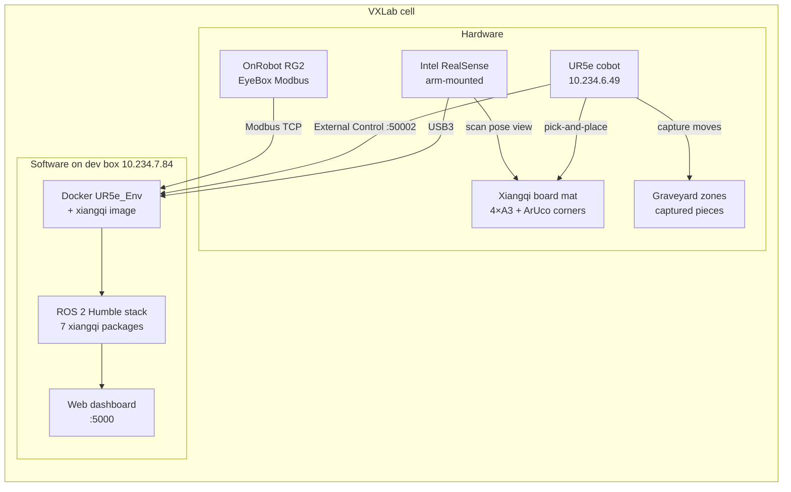
```mermaid
flowchart LR
  subgraph lab [VXLab cell]
    subgraph hw [Hardware]
      UR5e["UR5e cobot<br/>10.234.6.49"]
      RG2["OnRobot RG2<br/>EyeBox Modbus"]
      CAM["Intel RealSense<br/>arm-mounted"]
      BOARD["Xiangqi board mat<br/>4×A3 + ArUco corners"]
      GY["Graveyard zones<br/>captured pieces"]
    end
    subgraph sw [Software on dev box 10.234.7.84]
      DOCKER["Docker UR5e_Env<br/>+ xiangqi image"]
      ROS["ROS 2 Humble stack<br/>7 xiangqi packages"]
      WEB["Web dashboard<br/>:5000"]
    end
  end

  CAM -->|USB3| DOCKER
  UR5e -->|External Control :50002| DOCKER
  RG2 -->|Modbus TCP| DOCKER
  DOCKER --> ROS
  ROS --> WEB
  UR5e -->|pick-and-place| BOARD
  UR5e -->|capture moves| GY
  CAM -->|scan pose view| BOARD
```

---

## Figure 2 — Architecture selection rationale

**Caption:** Comparison of robot software architectures considered for the project. A three-tier hierarchical design was selected because Xiangqi requires long-horizon deliberation (FEN and search), explicit multi-step motion sequencing (capture, place, verify), and continuous low-level perception and control.

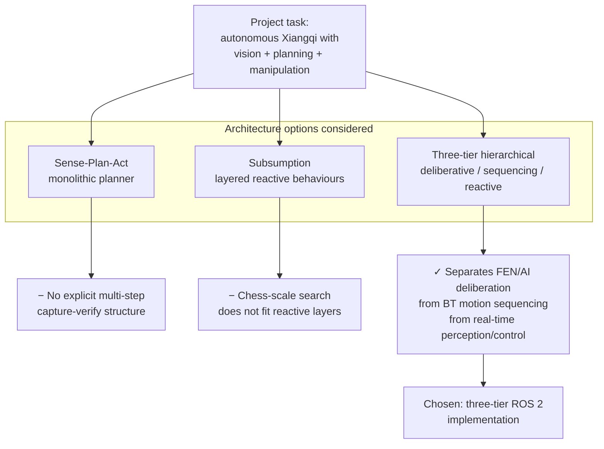
```mermaid
flowchart TB
  TASK["Project task:<br/>autonomous Xiangqi with<br/>vision + planning + manipulation"]

  subgraph options [Architecture options considered]
    SPA["Sense-Plan-Act<br/>monolithic planner"]
    SUB["Subsumption<br/>layered reactive behaviours"]
    TIER["Three-tier hierarchical<br/>deliberative / sequencing / reactive"]
  end

  TASK --> SPA
  TASK --> SUB
  TASK --> TIER

  SPA --> SPA_X["− No explicit multi-step<br/>capture-verify structure"]
  SUB --> SUB_X["− Chess-scale search<br/>does not fit reactive layers"]
  TIER --> TIER_OK["✓ Separates FEN/AI deliberation<br/>from BT motion sequencing<br/>from real-time perception/control"]

  TIER_OK --> CHOSEN["Chosen: three-tier ROS 2<br/>implementation"]
```

---

## Figure 3 — Three-tier ROS 2 node architecture *(primary architecture figure)*

**Caption:** Implemented three-tier architecture and ROS 2 node graph. Solid arrows are command/data paths during normal play; dashed arrows are monitoring and HMI. Human move inference resides in the deliberative `game_manager_node`; the behaviour tree executes only after `AiMoveCommand`.

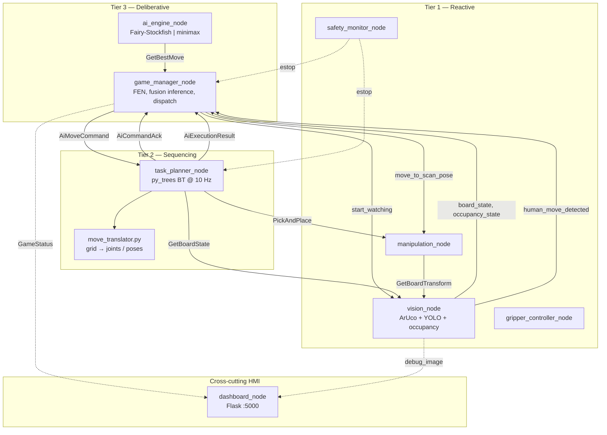
```mermaid
graph TB
  subgraph deliberative [Tier 3 — Deliberative]
    GM["game_manager_node<br/>FEN, fusion inference, dispatch"]
    AI["ai_engine_node<br/>Fairy-Stockfish | minimax"]
  end

  subgraph sequencing [Tier 2 — Sequencing]
    TP["task_planner_node<br/>py_trees BT @ 10 Hz"]
    MT["move_translator.py<br/>grid → joints / poses"]
  end

  subgraph reactive [Tier 1 — Reactive]
    VN["vision_node<br/>ArUco + YOLO + occupancy"]
    MN["manipulation_node"]
    GR["gripper_controller_node"]
    SF["safety_monitor_node"]
  end

  subgraph cross [Cross-cutting HMI]
    DB["dashboard_node<br/>Flask :5000"]
  end

  GM -->|AiMoveCommand| TP
  TP -->|AiCommandAck| GM
  TP -->|AiExecutionResult| GM
  GM -->|move_to_scan_pose| MN
  GM -->|start_watching| VN
  AI -->|GetBestMove| GM
  VN -->|board_state, occupancy_state| GM
  VN -->|human_move_detected| GM
  TP -->|PickAndPlace| MN
  TP -->|GetBoardState| VN
  MN -->|GetBoardTransform| VN
  TP --> MT
  SF -.->|estop| TP
  SF -.->|estop| GM
  GM -.->|GameStatus| DB
  VN -.->|debug_image| DB
```

---

## Figure 4 — Vision processing pipeline

**Caption:** Perception pipeline in `vision_node`. ArUco markers define a homography to a normalized board image. YOLO supplies piece identity; a ResNet-34 occupancy head supplies fast binary occupancy. Temporal stabilizers reduce single-frame jitter before publication.

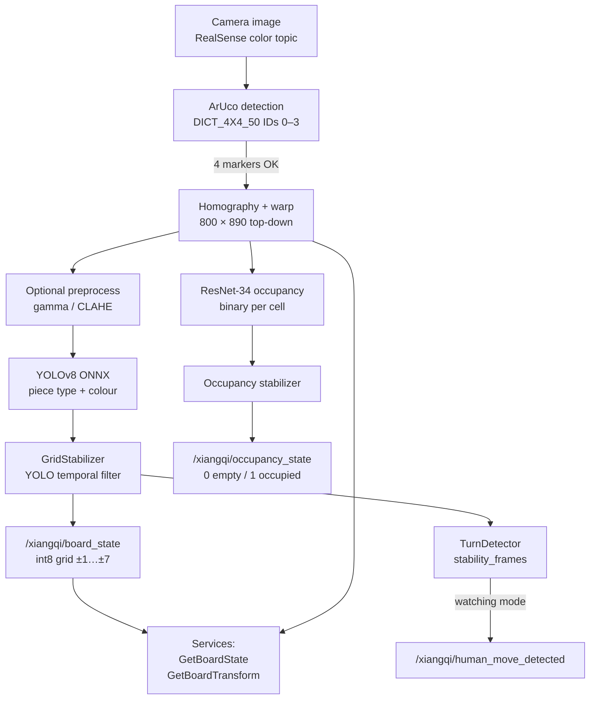
```mermaid
flowchart TB
  CAM["Camera image<br/>RealSense color topic"]
  ARUCO["ArUco detection<br/>DICT_4X4_50 IDs 0–3"]
  HOMO["Homography + warp<br/>800 × 890 top-down"]
  PRE["Optional preprocess<br/>gamma / CLAHE"]
  YOLO["YOLOv8 ONNX<br/>piece type + colour"]
  OCC["ResNet-34 occupancy<br/>binary per cell"]
  STAB_Y["GridStabilizer<br/>YOLO temporal filter"]
  STAB_O["Occupancy stabilizer"]
  PUB_Y["/xiangqi/board_state<br/>int8 grid ±1…±7"]
  PUB_O["/xiangqi/occupancy_state<br/>0 empty / 1 occupied"]
  TURN["TurnDetector<br/>stability_frames"]
  HMD["/xiangqi/human_move_detected"]

  CAM --> ARUCO
  ARUCO -->|4 markers OK| HOMO
  HOMO --> PRE
  PRE --> YOLO
  HOMO --> OCC
  YOLO --> STAB_Y --> PUB_Y
  OCC --> STAB_O --> PUB_O
  STAB_Y --> TURN
  TURN -->|watching mode| HMD

  SRV["Services:<br/>GetBoardState<br/>GetBoardTransform"]

  PUB_Y --> SRV
  HOMO --> SRV
```

---

## Figure 5 — Dual-sensor perception fusion (original work)

**Caption:** Fusion of YOLO and occupancy grids in `game_manager_node` for human move inference. Occupancy improves empty-cell reliability; YOLO supplies piece type where a cell is occupied. The same occupancy stream watches for human interference during robot motion.

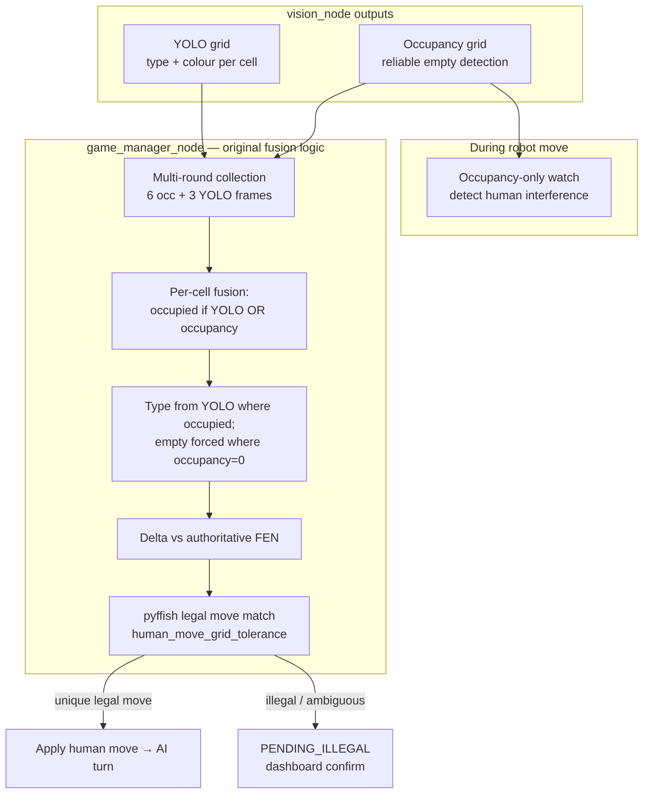
```mermaid
flowchart TB
  subgraph vision [vision_node outputs]
    Y["YOLO grid<br/>type + colour per cell"]
    O["Occupancy grid<br/>reliable empty detection"]
  end

  subgraph gm [game_manager_node — original fusion logic]
    COLLECT["Multi-round collection<br/>6 occ + 3 YOLO frames"]
    FUSE["Per-cell fusion:<br/>occupied if YOLO OR occupancy"]
    TYPE["Type from YOLO where occupied;<br/>empty forced where occupancy=0"]
    DELTA["Delta vs authoritative FEN"]
    PYF["pyffish legal move match<br/>human_move_grid_tolerance"]
  end

  OUT_OK["Apply human move → AI turn"]
  OUT_ILL["PENDING_ILLEGAL<br/>dashboard confirm"]

  Y --> COLLECT
  O --> COLLECT
  COLLECT --> FUSE --> TYPE --> DELTA --> PYF
  PYF -->|unique legal move| OUT_OK
  PYF -->|illegal / ambiguous| OUT_ILL

  subgraph ai_turn [During robot move]
    WATCH["Occupancy-only watch<br/>detect human interference"]
  end
  O --> WATCH
```

---

## Figure 6 — Game manager finite-state machine

**Caption:** Internal finite-state machine of `game_manager_node`. The `PENDING_ILLEGAL` state pauses play until the operator confirms or overrides via the web dashboard.

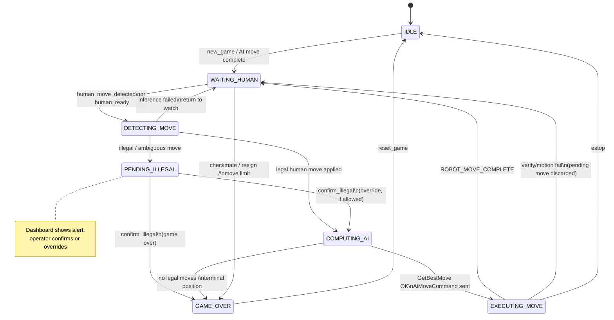
```mermaid
stateDiagram-v2
  [*] --> IDLE

  IDLE --> WAITING_HUMAN: new_game / AI move complete
  WAITING_HUMAN --> DETECTING_MOVE: human_move_detected\nor human_ready
  DETECTING_MOVE --> WAITING_HUMAN: inference failed\nreturn to watch
  DETECTING_MOVE --> PENDING_ILLEGAL: illegal / ambiguous move
  DETECTING_MOVE --> COMPUTING_AI: legal human move applied

  PENDING_ILLEGAL --> GAME_OVER: confirm_illegal\n(game over)
  PENDING_ILLEGAL --> COMPUTING_AI: confirm_illegal\n(override, if allowed)

  COMPUTING_AI --> EXECUTING_MOVE: GetBestMove OK\nAiMoveCommand sent
  COMPUTING_AI --> GAME_OVER: no legal moves /\nterminal position
  EXECUTING_MOVE --> WAITING_HUMAN: ROBOT_MOVE_COMPLETE
  EXECUTING_MOVE --> WAITING_HUMAN: verify/motion fail\n(pending move discarded)
  EXECUTING_MOVE --> IDLE: estop

  WAITING_HUMAN --> GAME_OVER: checkmate / resign /\nmove limit
  GAME_OVER --> IDLE: reset_game

  note right of PENDING_ILLEGAL
    Dashboard shows alert;
    operator confirms or overrides
  end note
```

---

## Figure 7 — Robot move sequence (one AI turn)

**Caption:** Message sequence for a single robot move from AI selection through behaviour-tree execution and board verification.

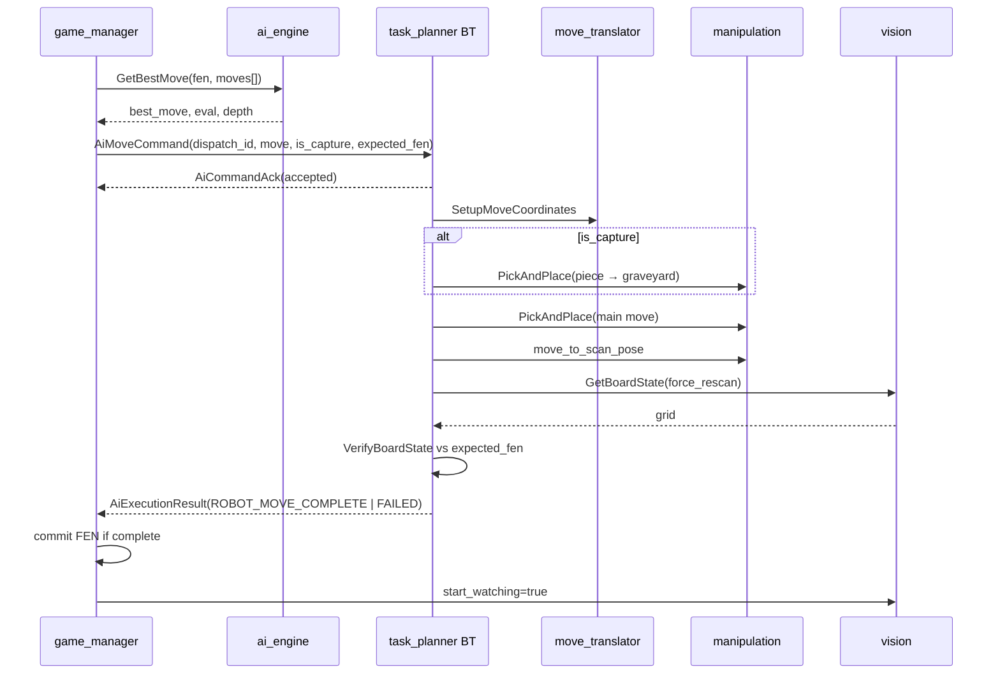
```mermaid
sequenceDiagram
  participant GM as game_manager
  participant AI as ai_engine
  participant TP as task_planner BT
  participant MT as move_translator
  participant MN as manipulation
  participant VN as vision

  GM->>AI: GetBestMove(fen, moves[])
  AI-->>GM: best_move, eval, depth
  GM->>TP: AiMoveCommand(dispatch_id, move, is_capture, expected_fen)
  TP-->>GM: AiCommandAck(accepted)
  TP->>MT: SetupMoveCoordinates
  alt is_capture
    TP->>MN: PickAndPlace(piece → graveyard)
  end
  TP->>MN: PickAndPlace(main move)
  TP->>MN: move_to_scan_pose
  TP->>VN: GetBoardState(force_rescan)
  VN-->>TP: grid
  TP->>TP: VerifyBoardState vs expected_fen
  TP-->>GM: AiExecutionResult(ROBOT_MOVE_COMPLETE | FAILED)
  GM->>GM: commit FEN if complete
  GM->>VN: start_watching=true
```

---

## Figure 8 — Task planner behaviour tree

**Caption:** Behaviour tree structure in `task_planner_node` (py_trees). The tree ticks at 10 Hz when a move is dispatched. Board verification retries up to five times before failure is reported to the game manager.

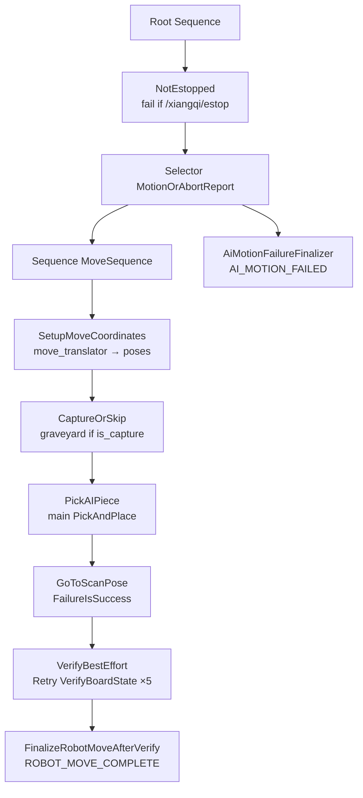
```mermaid
flowchart TB
  ROOT["Root Sequence"]
  ESTOP["NotEstopped<br/>fail if /xiangqi/estop"]
  SEL["Selector MotionOrAbortReport"]

  SEQ["Sequence MoveSequence"]
  SETUP["SetupMoveCoordinates<br/>move_translator → poses"]
  CAP["CaptureOrSkip<br/>graveyard if is_capture"]
  PICK["PickAIPiece<br/>main PickAndPlace"]
  SCAN["GoToScanPose<br/>FailureIsSuccess"]
  VER["VerifyBestEffort<br/>Retry VerifyBoardState ×5"]
  FIN["FinalizeRobotMoveAfterVerify<br/>ROBOT_MOVE_COMPLETE"]
  FAIL["AiMotionFailureFinalizer<br/>AI_MOTION_FAILED"]

  ROOT --> ESTOP --> SEL
  SEL --> SEQ
  SEL --> FAIL
  SEQ --> SETUP --> CAP --> PICK --> SCAN --> VER --> FIN
```

---

## Figure 9 — Human turn sequence

**Caption:** Human-turn workflow on hardware, including vision stability detection, optional Confirm-move fallback, fused move inference, and illegal-move handling.

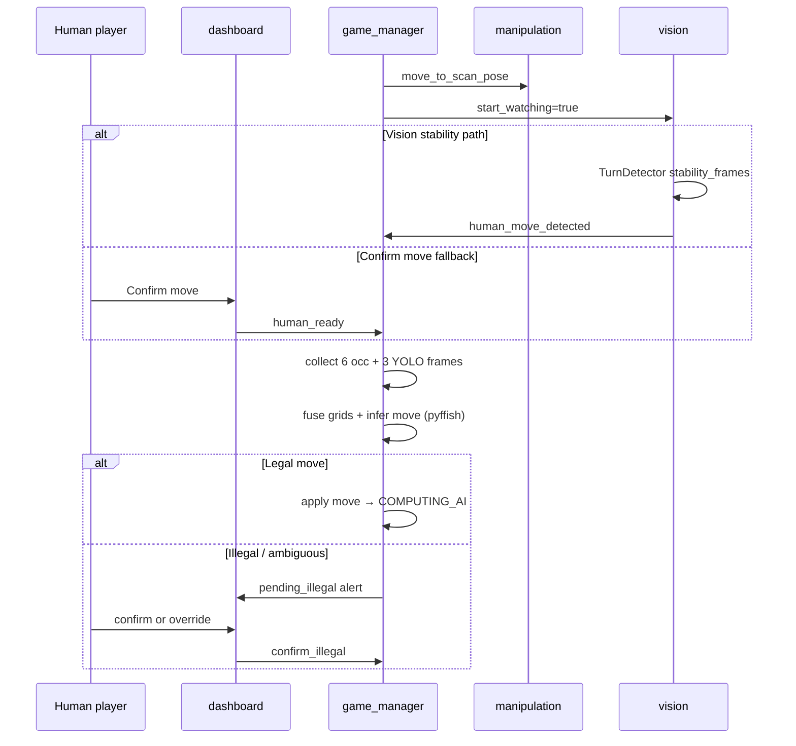
```mermaid
sequenceDiagram
  participant H as Human player
  participant DB as dashboard
  participant GM as game_manager
  participant MN as manipulation
  participant VN as vision

  GM->>MN: move_to_scan_pose
  GM->>VN: start_watching=true
  alt Vision stability path
    VN->>VN: TurnDetector stability_frames
    VN->>GM: human_move_detected
  else Confirm move fallback
    H->>DB: Confirm move
    DB->>GM: human_ready
  end
  GM->>GM: collect 6 occ + 3 YOLO frames
  GM->>GM: fuse grids + infer move (pyffish)
  alt Legal move
    GM->>GM: apply move → COMPUTING_AI
  else Illegal / ambiguous
    GM->>DB: pending_illegal alert
    H->>DB: confirm or override
    DB->>GM: confirm_illegal
  end
```

---

## Figure 10 — Pick-and-place motion phases

**Caption:** Phases of the `PickAndPlace` action and associated motion backends on the UR5e. Taught joint interpolation is preferred for board cells; Cartesian waypoints are used for vertical segments when required.

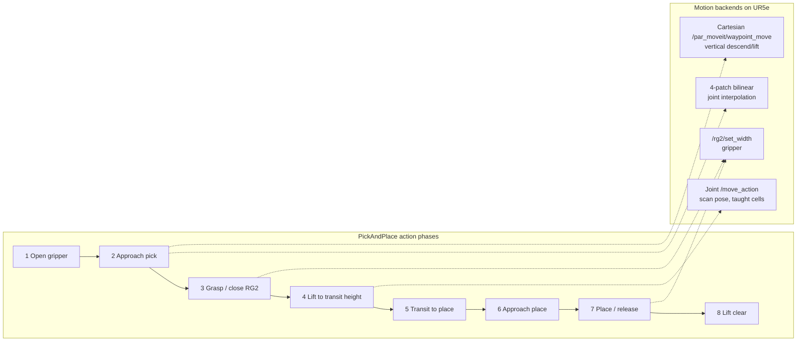
```mermaid
flowchart LR
  subgraph phases [PickAndPlace action phases]
    P1["1 Open gripper"]
    P2["2 Approach pick"]
    P3["3 Grasp / close RG2"]
    P4["4 Lift to transit height"]
    P5["5 Transit to place"]
    P6["6 Approach place"]
    P7["7 Place / release"]
    P8["8 Lift clear"]
  end

  subgraph motion [Motion backends on UR5e]
    J["Joint /move_action<br/>scan pose, taught cells"]
    B["4-patch bilinear<br/>joint interpolation"]
    C["Cartesian /par_moveit/waypoint_move<br/>vertical descend/lift"]
    G["/rg2/set_width<br/>gripper"]
  end

  P1 --> P2 --> P3 --> P4 --> P5 --> P6 --> P7 --> P8
  P2 -.-> B
  P2 -.-> C
  P3 -.-> G
  P7 -.-> G
  P4 -.-> J
```

---

## Figure 11 — Board calibration workflow

**Caption:** Interactive calibration pipeline (`calibration_tool`) producing `board_calibration.yaml`, shared by vision warping and manipulation joint interpolation.

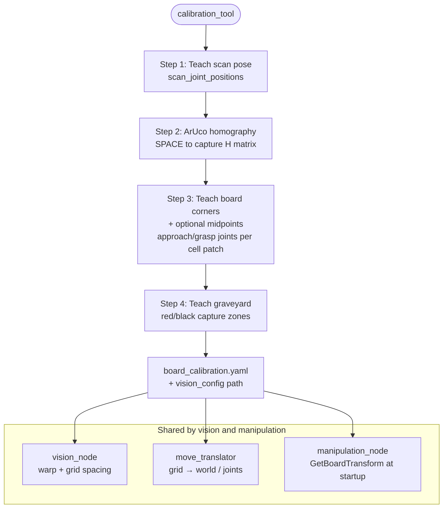
```mermaid
flowchart TB
  START(["calibration_tool"])
  S1["Step 1: Teach scan pose<br/>scan_joint_positions"]
  S2["Step 2: ArUco homography<br/>SPACE to capture H matrix"]
  S3["Step 3: Teach board corners<br/>+ optional midpoints<br/>approach/grasp joints per cell patch"]
  S4["Step 4: Teach graveyard<br/>red/black capture zones"]
  OUT["board_calibration.yaml<br/>+ vision_config path"]

  START --> S1 --> S2 --> S3 --> S4 --> OUT

  subgraph consumers [Shared by vision and manipulation]
    V["vision_node<br/>warp + grid spacing"]
    M["move_translator<br/>grid → world / joints"]
    MN["manipulation_node<br/>GetBoardTransform at startup"]
  end

  OUT --> V
  OUT --> M
  OUT --> MN
```

---

## Figure 12 — Evaluation experiment design

**Caption:** Planned evaluation methodology for the final demonstration and report. Each experiment produces quantitative evidence for the Analysis section (see [`report_tables.md`](report_tables.md)).

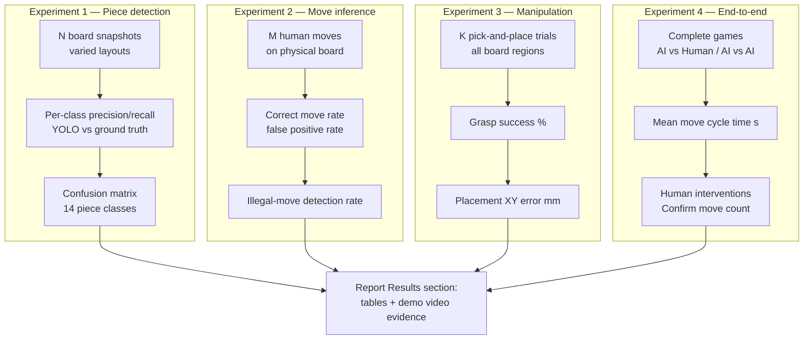
```mermaid
flowchart TB
  subgraph E1 [Experiment 1 — Piece detection]
    E1A["N board snapshots<br/>varied layouts"]
    E1B["Per-class precision/recall<br/>YOLO vs ground truth"]
    E1C["Confusion matrix<br/>14 piece classes"]
  end

  subgraph E2 [Experiment 2 — Move inference]
    E2A["M human moves<br/>on physical board"]
    E2B["Correct move rate<br/>false positive rate"]
    E2C["Illegal-move detection rate"]
  end

  subgraph E3 [Experiment 3 — Manipulation]
    E3A["K pick-and-place trials<br/>all board regions"]
    E3B["Grasp success %"]
    E3C["Placement XY error mm"]
  end

  subgraph E4 [Experiment 4 — End-to-end]
    E4A["Complete games<br/>AI vs Human / AI vs AI"]
    E4B["Mean move cycle time s"]
    E4C["Human interventions<br/>Confirm move count"]
  end

  E1A --> E1B --> E1C
  E2A --> E2B --> E2C
  E3A --> E3B --> E3C
  E4A --> E4B --> E4C

  REPORT["Report Results section:<br/>tables + demo video evidence"]

  E1C --> REPORT
  E2C --> REPORT
  E3C --> REPORT
  E4C --> REPORT
```

---

## Figure 13 — AiMoveCommand dispatch protocol *(optional / appendix)*

**Caption:** Atomic dispatch protocol between game manager and task planner using monotonic `dispatch_id` to match acknowledgements and execution results.

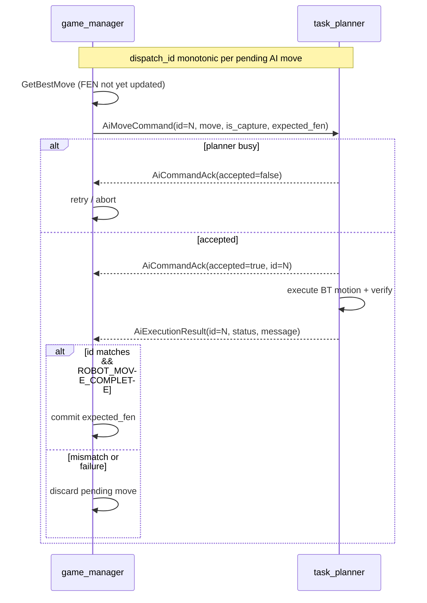
```mermaid
sequenceDiagram
  participant GM as game_manager
  participant TP as task_planner

  Note over GM,TP: dispatch_id monotonic per pending AI move

  GM->>GM: GetBestMove (FEN not yet updated)
  GM->>TP: AiMoveCommand(id=N, move, is_capture, expected_fen)
  alt planner busy
    TP-->>GM: AiCommandAck(accepted=false)
    GM->>GM: retry / abort
  else accepted
    TP-->>GM: AiCommandAck(accepted=true, id=N)
    TP->>TP: execute BT motion + verify
    TP-->>GM: AiExecutionResult(id=N, status, message)
    alt id matches && ROBOT_MOVE_COMPLETE
      GM->>GM: commit expected_fen
    else mismatch or failure
      GM->>GM: discard pending move
    end
  end
```

---

## Figure 14 — Scan Board and prescan FEN

**Caption:** Pre-game board scanning via the web dashboard. Three rescan rounds are merged by majority vote; the resulting FEN seeds the game manager on Start Game.

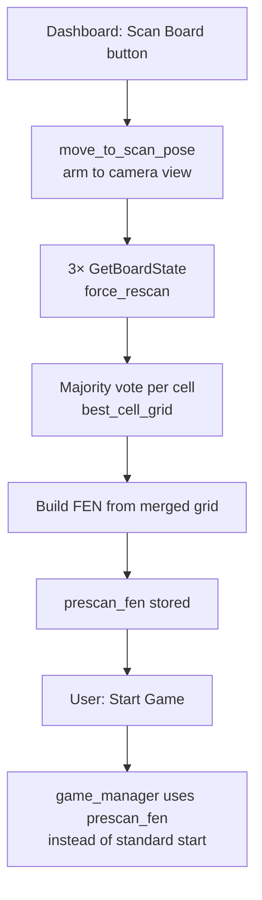
```mermaid
flowchart TB
  UI["Dashboard: Scan Board button"]
  POSE["move_to_scan_pose<br/>arm to camera view"]
  ROUNDS["3× GetBoardState<br/>force_rescan"]
  VOTE["Majority vote per cell<br/>best_cell_grid"]
  FEN["Build FEN from merged grid"]
  STORE["prescan_fen stored"]
  START["User: Start Game"]
  GM["game_manager uses prescan_fen<br/>instead of standard start"]

  UI --> POSE --> ROUNDS --> VOTE --> FEN --> STORE
  STORE --> START --> GM
```

---

## Figure 15 — Deployment and ROS 2 infrastructure

**Caption:** Software deployment stack showing Docker extension of UR5e_Env, VXLab driver prerequisites, and integration with MoveIt and RG2 interfaces (UG infrastructure contribution).

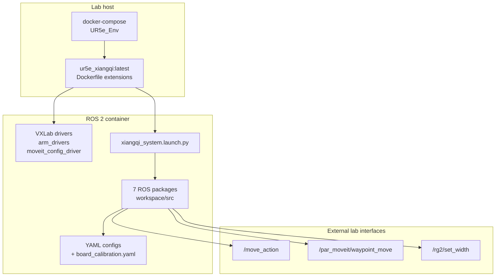
```mermaid
flowchart TB
  subgraph host [Lab host]
    DC["docker-compose<br/>UR5e_Env"]
    IMG["ur5e_xiangqi:latest<br/>Dockerfile extensions"]
  end

  subgraph container [ROS 2 container]
    DRV["VXLab drivers<br/>arm_drivers<br/>moveit_config_driver"]
    LAUNCH["xiangqi_system.launch.py"]
    PKG["7 ROS packages<br/>workspace/src"]
    CFG["YAML configs<br/>+ board_calibration.yaml"]
  end

  subgraph external [External lab interfaces]
    MA["/move_action"]
    WP["/par_moveit/waypoint_move"]
    RG["/rg2/set_width"]
  end

  DC --> IMG --> DRV
  IMG --> LAUNCH
  LAUNCH --> PKG
  PKG --> CFG
  PKG --> MA
  PKG --> WP
  PKG --> RG
```

---

## Figure 16 — Custom minimax engine (UG second algorithm)

**Caption:** Structure of the custom iterative-deepening alpha-beta engine. Legal moves and terminal detection use pyffish; evaluation uses a hand-crafted function in `evaluation.py`. Fairy-Stockfish provides a comparison baseline.

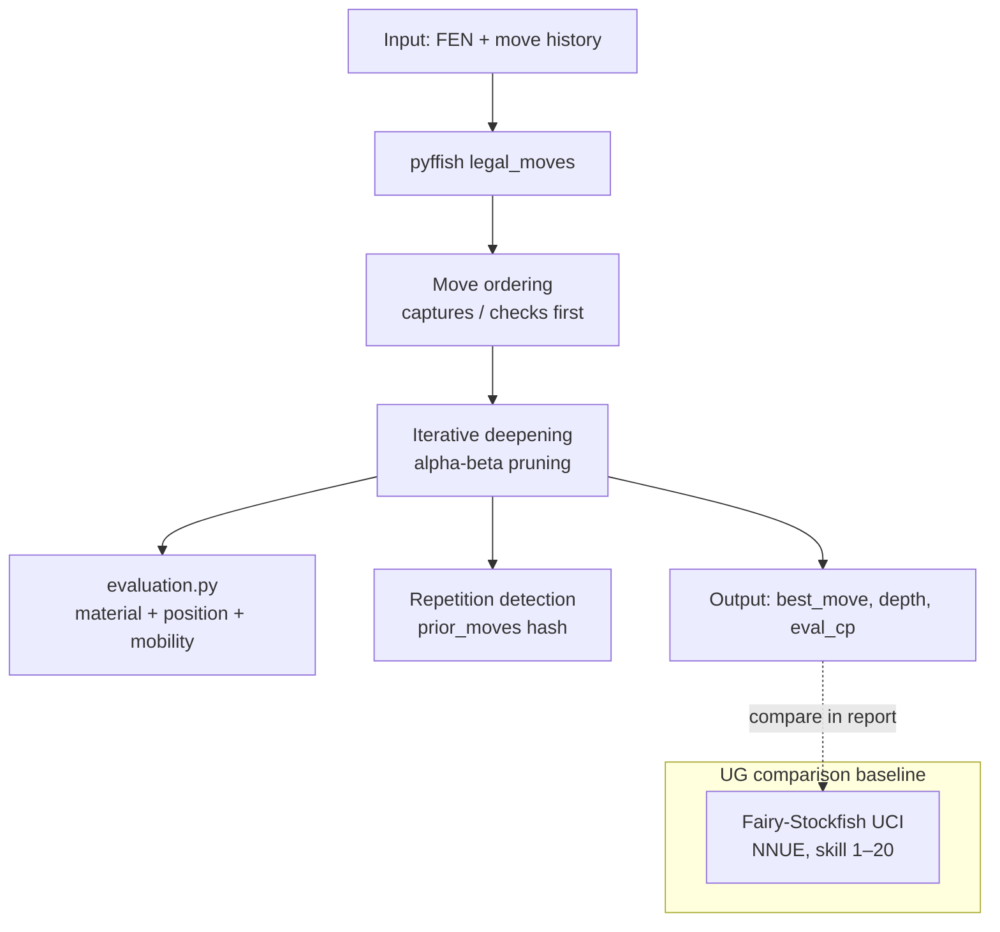
```mermaid
flowchart TB
  FEN["Input: FEN + move history"]
  LEGAL["pyffish legal_moves"]
  ORDER["Move ordering<br/>captures / checks first"]
  ID["Iterative deepening<br/>alpha-beta pruning"]
  EVAL["evaluation.py<br/>material + position + mobility"]
  REP["Repetition detection<br/>prior_moves hash"]
  OUT["Output: best_move, depth, eval_cp"]

  FEN --> LEGAL --> ORDER --> ID
  ID --> EVAL
  ID --> REP
  ID --> OUT

  subgraph compare [UG comparison baseline]
    FSF["Fairy-Stockfish UCI<br/>NNUE, skill 1–20"]
  end

  OUT -.->|compare in report| FSF
```

---

## Figure 17 — ROS 2 package map *(optional)*

**Caption:** Seven ROS 2 packages and their tier assignment. `xiangqi_msgs` defines interfaces; `xiangqi_bringup` supplies launch files and parameters.

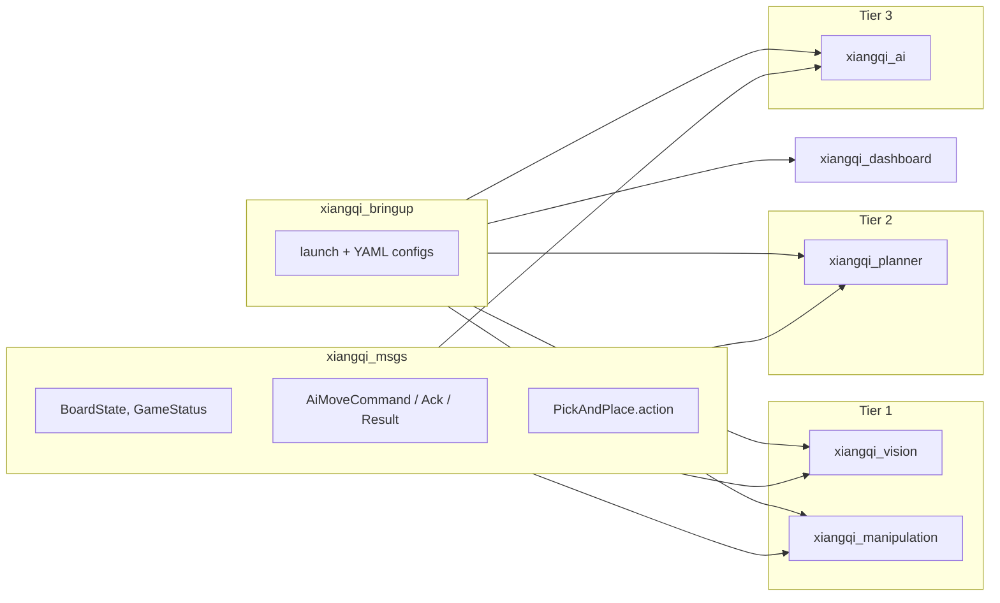
```mermaid
flowchart LR
  subgraph msgs [xiangqi_msgs]
    M1["BoardState, GameStatus"]
    M2["AiMoveCommand / Ack / Result"]
    M3["PickAndPlace.action"]
  end

  subgraph bringup [xiangqi_bringup]
    B1["launch + YAML configs"]
  end

  subgraph tier1 [Tier 1]
    V[xiangqi_vision]
    MAN[xiangqi_manipulation]
  end

  subgraph tier2 [Tier 2]
    P[xiangqi_planner]
  end

  subgraph tier3 [Tier 3]
    A[xiangqi_ai]
  end

  D[xiangqi_dashboard]

  bringup --> V
  bringup --> MAN
  bringup --> P
  bringup --> A
  bringup --> D
  msgs --> V
  msgs --> MAN
  msgs --> P
  msgs --> A
```

---

## Figure 18 — Illegal move confirmation flow *(optional)*

**Caption:** Operator-in-the-loop path when move inference detects an illegal or ambiguous board change.

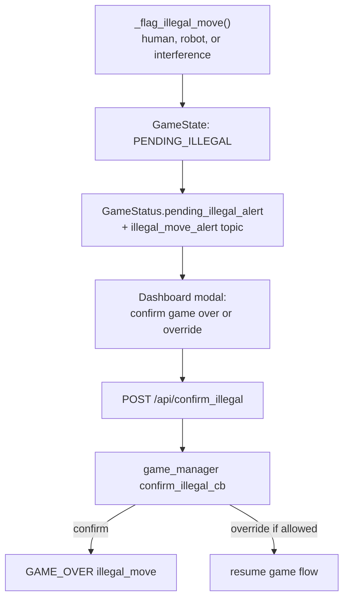
```mermaid
flowchart TB
  DETECT["_flag_illegal_move()<br/>human, robot, or interference"]
  PAUSE["GameState: PENDING_ILLEGAL"]
  PUB["GameStatus.pending_illegal_alert<br/>+ illegal_move_alert topic"]
  UI["Dashboard modal:<br/>confirm game over or override"]
  API["POST /api/confirm_illegal"]
  CB["game_manager confirm_illegal_cb"]

  DETECT --> PAUSE --> PUB --> UI
  UI --> API --> CB
  CB -->|confirm| GO["GAME_OVER illegal_move"]
  CB -->|override if allowed| RESUME["resume game flow"]
```
