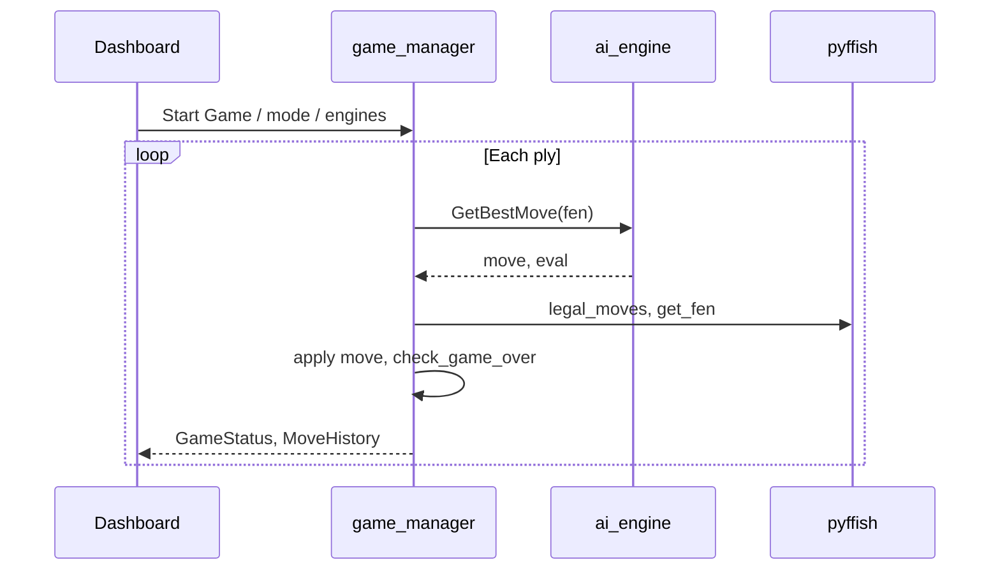

# Simulation mode guide

Full **setup and run instructions** are in the root [README.md](../README.md#simulation-mode). This document explains how simulation works, how it differs from hardware play, and how to debug common issues.

---

## What simulation mode is

Simulation sets ROS parameter **`simulation_mode:=true`** (via `xiangqi_sim.launch.py` or `xiangqi_system.launch.py simulation_mode:=true`).

The full node graph still starts (`game_manager`, `ai_engine`, `task_planner`, `vision`, `manipulation`, `gripper`, `safety`, `dashboard`), but:

- **Board state** is a logical Xiangqi position updated by **pyffish** inside `game_manager_node`.
- **Moves** from the AI are applied in software immediately (no `AiMoveCommand` → arm).
- **Human moves** in AI vs Human come from **dashboard clicks** (`/api/simulate_move`), not from the camera.
- **AI vs AI** and **AI vs Human** are both available from the dashboard (hardware runs the full arm loop for AI vs AI).

Use simulation to develop and test: rules, engines (Minimax / Fairy-Stockfish), game-end detection, dashboard UI, and ROS message flow—without the UR5e, RealSense, MoveIt, or RG2.

---

## Simulation vs hardware

| Topic | Simulation | Hardware (lab) |
|-------|------------|----------------|
| Board state | pyffish FEN in `game_manager` | `vision_node` → `BoardState` from warped camera + YOLO |
| Human input | Dashboard board clicks | Physical pieces; vision stability detection |
| Robot execution | Skipped (instant FEN update) | Behaviour tree → `PickAndPlace` → MoveIt + gripper |
| Required drivers | None | `arm_drivers`, `moveit_config_driver`, RealSense |
| Vision config | `vision_config_sim.yaml` (YOLO optional) | `vision_config.yaml` + `board_calibration.yaml` + weights |
| Game modes | AI vs AI, AI vs Human | AI vs AI, AI vs Human |
| Default think time cap | `sim_ai_time_limit` (3 s) | `ai_time_limit` (5 s) |
| Scan pose / planner | BT runs but arm not needed for moves | Full pick-and-place pipeline |

---

## Software architecture (sim)



In hardware mode, after `GetBestMove`, `game_manager` publishes `AiMoveCommand` and waits for `AiExecutionResult` from the planner instead of applying the move directly.

---

## Prerequisites

| Requirement | Notes |
|-------------|--------|
| **Docker** | With WSL2 on Windows, or Linux |
| **Base image** | Lab `ros:humble` from UR5e_Env, or any ROS 2 Humble image matching the Dockerfile `BASE_IMAGE` |
| **Extended image** | `ur5e_xiangqi:latest` from this repo’s [Dockerfile](../Dockerfile) (Fairy-Stockfish + pyffish from same source, dashboard deps) |
| **Git clone** | This repository on the host |
| **Ports** | Host **5000** free (default for `wsl_docker_sim_run.sh`) |

YOLO weights are **included** in git at `workspace/src/xiangqi_vision/models/xiangqi_kaggle_v1_best.pt`. Vision in sim does not need a live camera for dashboard-only play.

---

## Configuration reference

| File / parameter | Purpose |
|------------------|---------|
| `xiangqi_bringup/config/game_config.yaml` | `ai_time_limit`, `sim_ai_time_limit` (3 s), engine defaults |
| `xiangqi_bringup/config/vision_config_sim.yaml` | Sim vision: optional YOLO, no lab calibration required |
| Launch `difficulty` | Fairy-Stockfish skill level 1–20 (dashboard slider overrides at runtime) |
| Launch `engine_type` | Default engine if not set per-side on dashboard |
| `ai_engine_node` `minimax_nnue_display_eval` | Minimax moves use NNUE for **displayed** cp only |

---

## Launch arguments

From `xiangqi_sim.launch.py` / `xiangqi_system.launch.py`:

| Argument | Default (sim launch) | Meaning |
|----------|----------------------|---------|
| `simulation_mode` | `true` (sim launch only) | Enable logical board + dashboard-centric play |
| `engine_type` | `minimax` | Fallback engine type |
| `difficulty` | `20` | Stockfish skill level |
| `self_play` | `false` | Overridden by dashboard **AI vs AI** |
| `robot_plays_red` | `false` | In sim without self-play: human Red on dashboard |

Example:

```bash
ros2 launch xiangqi_bringup xiangqi_sim.launch.py \
  engine_type:=fairystockfish difficulty:=20
```

---

## Verification and test scripts

| Script | Use |
|--------|-----|
| `tools/verify_api_pyffish.py` | After a finished game, compare dashboard result vs pyffish |
| `tools/docker_verify_fsf_pyffish.py` | Run at Docker **build** time (UCI legality) |
| `tools/check_dashboard_flow.py` | HTTP flow: start game, poll state |
| `tools/quick_ai_vs_ai_test.py` | Short AI vs AI smoke test |
| `tools/test_stop_reset.py` | Stop / reset API |

---

## Troubleshooting

### Stockfish moves look random; logs show `not in pyffish legal set`

Fairy-Stockfish UCI strings must match pyffish `legal_moves`. Rebuild the image so pyffish is compiled from the **same** Fairy-Stockfish tree with `largeboards=yes` (see Dockerfile). Restart the container after code changes.

### `AI engine error` right after a strong move

Usually checkmate with **zero legal moves** but game-over not declared. Ensure latest `game_manager_node` (uses `game_result()` when `legal_moves` is empty). Reset and play again.

### Dashboard stuck / move count behind

Hard-refresh (Ctrl+F5). Sim uses REST polling plus WebSocket; stale tabs after reconnect can lag.

### `AI engine returned no move`

Engine subprocess failed or timed out. Check `docker logs` for `ai_engine_node`. Increase `sim_ai_time_limit` in `game_config.yaml` if needed.

### Eval bar shows huge mate scores (e.g. +30000)

Mate scores from Stockfish; UI may clamp the bar. Move history may still show raw cp.

### Container build slow every start

`wsl_docker_sim_run.sh` copies workspace and runs `colcon build` each time. For iteration, use a long-lived shell in the container and `colcon build` only when packages change.

---

## What simulation does not replace

- Pick-and-place accuracy, gripper force, or collision checking on the real arm.
- Camera lighting, ArUco detection, or YOLO generalization on the physical mat.
- Latency and failure modes of MoveIt / Modbus gripper.

Validate those on hardware using [README.md](../README.md#quick-start-lab-docker) and [vision_training_guide.md](vision_training_guide.md).
